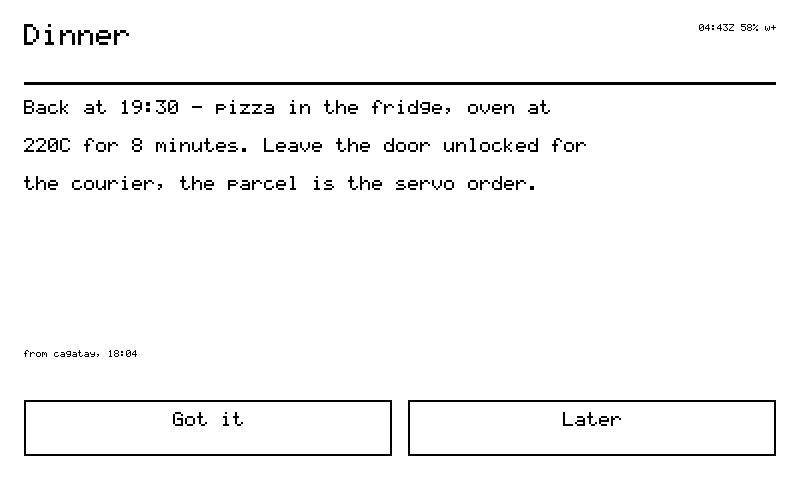
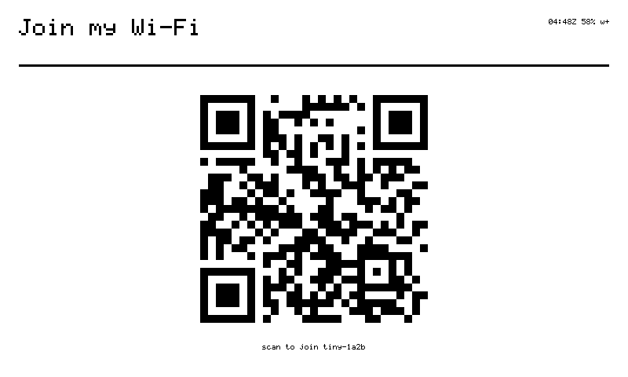
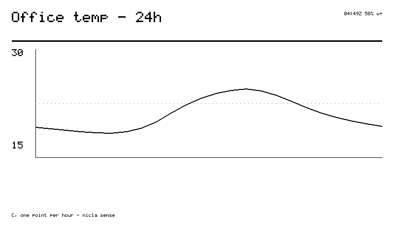

<h1 align="center">sticky</h1>

<p align="center"><b>A 70-gram e-ink body for your tiny.</b><br>
<sub>Custom ESP-IDF firmware for the Seeed reTerminal Sticky</sub></p>

<p align="center">
  <a href="https://cagataycali.github.io/sticky-the-reterminal/install/">Install</a> ·
  <a href="docs/start/quickstart.md">Quickstart</a> ·
  <a href="docs/commands.md">Commands</a> ·
  <a href="docs/cards.md">Cards</a> ·
  <a href="https://cagataycali.github.io/sticky-the-reterminal/">Docs</a>
</p>


Sticky is a pocket-sized e-ink card with Wi-Fi, a microphone, a touchscreen,
three buttons and a buzzer. This firmware replaces Seeed's demo and turns it
into a device on your [tiny.technology](https://tiny.technology) account: your
agent renders cards on the glass, you hold a button and talk to it, it answers
on screen. It holds nothing but a revocable device token.

## Install

Plug it in with USB-C. Chrome or Edge, one click:

**→ [cagataycali.github.io/sticky-the-reterminal/install](https://cagataycali.github.io/sticky-the-reterminal/install/)**

or from a terminal:

```sh
curl -fsSL https://cagataycali.github.io/sticky-the-reterminal/install.sh | sh
```

The first install erases the flash. If you want Seeed's demo back one day,
[dump it first](docs/start/quickstart.md#0-back-up-the-factory-brain-once-45-min)
— it takes about 45 minutes over serial.

On first boot the device walks you through Wi-Fi and pairing on its own
screen. No app required.

## What it does

- **Cards.** The agent sends a JSON card — `text`, `list`, `kv`, `menu`,
  `qr`, `chart`, `chat`, `composite` — the device draws it, and taps on the
  touch bar come back as events. Grammar in [Cards](docs/cards.md).
- **Voice.** Hold the AI button and speak. The PDM mic streams to the agent,
  which runs a full turn with tools and memory; the reply paints on the glass.
- **Verbs.** 23 of them, dispatched in
  [`firmware/main/tiny_node.cpp`](firmware/main/tiny_node.cpp): `render_ui`
  `status` `sensors` `say` `ask` `agent` `play` `voice` `screenshot` `miccheck`
  `page` `rotate` `glance` `tap` `swipe` `scroll` `lock` `unlock` `sleep` `ota`
  `messages` `config` `sd`. All in [Commands](docs/commands.md).
- **OTA.** sha256-pinned updates with a trial boot; no heartbeat, roll back.
- **Pocket safety.** The IMU locks touch, buttons and the mic when the device
  is face-down or you're walking.
- **Sleep.** Deep sleep at 10–20 µA with the last card still on the glass.
- **A local shell.** Home, status, sensors, settings, Wi-Fi and messages work
  without the network.

<p align="center">
  
  
  
  
</p>

## What it doesn't do

- **Video.** A full e-ink refresh is 1–2 s, partial ~300–500 ms with
  ghosting. Slideshows and short frame animations, yes; 24 fps, no.
- **Speak.** GPIO48 drives a buzzer, not a speaker. It chimes.
- **Think offline.** The agent is server-side. Without Wi-Fi you get the shell
  and the last card.

## Hardware

| | |
|---|---|
| SoC | ESP32-S3, 8 MB PSRAM, 32 MB flash |
| Display | 3.97" 800×480 e-ink, 4-gray, GT911 touch |
| Mic | PDM, GPIO 19/20 |
| Buzzer | GPIO48 |
| Sensors | SHT40 temp/humidity, LSM6DS3TR-C IMU, PCF8563 RTC, BQ27220 gauge |
| Battery | 750 mAh — days awake, weeks asleep |
| Weight | 70 g, N52 magnets in the corners |

Pins, buses and the power latch are in [Hardware](docs/hardware.md).

## Repository

```
firmware/      ESP-IDF v5.4 app — main/tiny_* modules on Seeed's HAL
vendor/        Seeed's reference drivers, unmodified (their terms, see vendor/README.md)
docs/          the site (mkdocs-material); docs/dashboard is a separate owner dashboard
tools/         flash, monitor, provision, release, registry packaging
tests/         host tests, plain C++, no board: tests/run.sh
playground/    Seeed Sticky Playground registry entry
recovery/      factory-dump manifest (the 32 MB dump is gitignored)
```

## Build

```sh
source ~/esp/esp-idf-v5.4/export.sh
cd firmware && idf.py build                         # → build/tiny_sticky.bin
STICKY_PORT=/dev/cu.usbmodemXXXX ../tools/flash.sh
```

[AGENTS.md](AGENTS.md) is the map of the codebase; [CONTRIBUTING.md](CONTRIBUTING.md)
has the workflow. Firmware is Apache-2.0 ([LICENSE](LICENSE)); `vendor/`
keeps Seeed's terms. Sister project: [strands-nicla](https://github.com/cagataycali/strands-nicla).

For the live numbers, ask the device — `status` — not the README.
