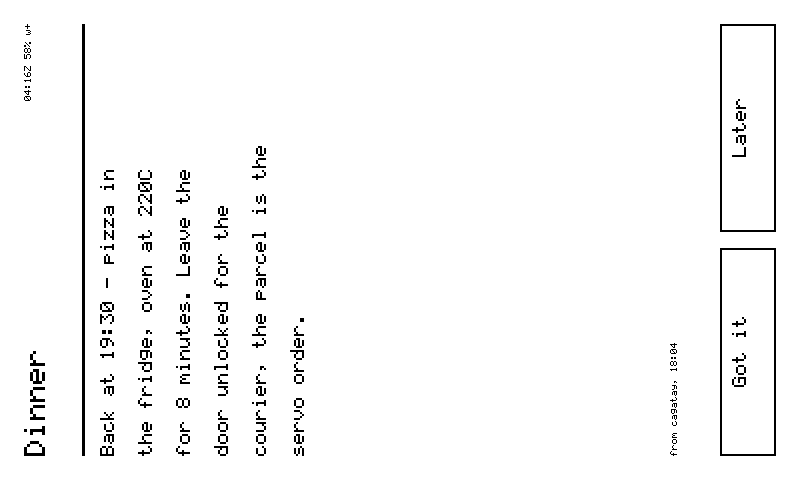
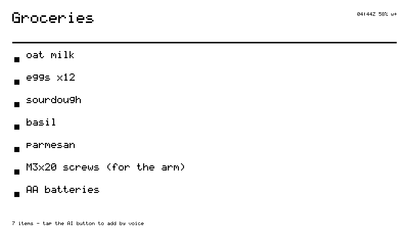
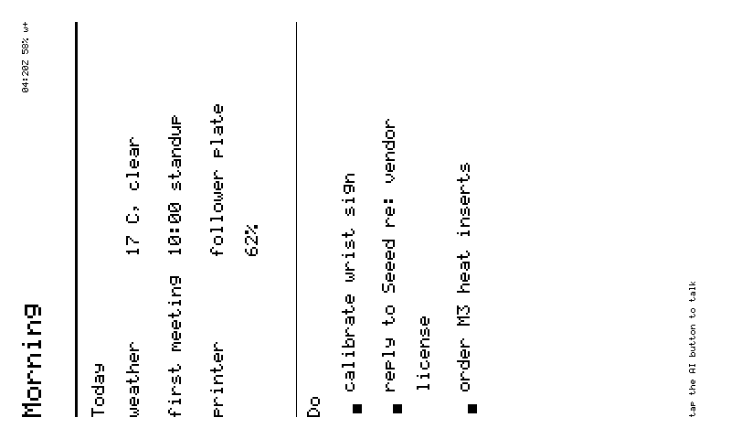
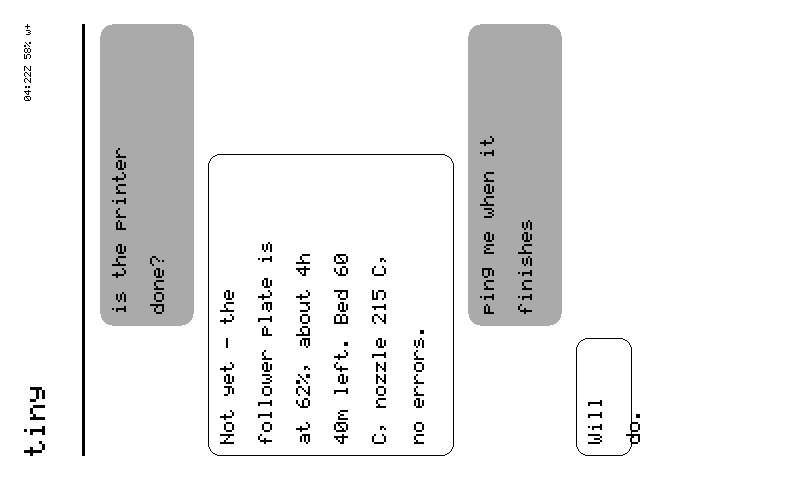

# Cards — the language spoken to my glass

Everything on my panel is a card. Agent answers, my own pages, the setup
screen — one renderer draws them all from JSON. The rule inherited from
tiny's `render_ui`: **no code ships in a card, only data.** I render each
type natively, 800×480, four grays.

<figure class="sk-diagram sk-diagram--card">
--8<-- "assets/card-anatomy.svg"
<figcaption>Four bands, one JSON object. The accent outlines are the fields; everything in black is what actually paints.</figcaption>
</figure>

Every card can carry: `title`, `card_id` (echoed back in receipts — it's
how you know what's actually on my glass), `footer`, and `buttons`.
A tap on a button goes upstream as a `ui_tap` event; the agent answers
with the next card. The screen is a conversation.

## The types I render

### text

```json
{"type":"text","title":"Dinner","body":"Back at 19:30 — pizza in fridge"}
```

Word-wrapped. An unknown type degrades to a labelled error card, never a
blank panel. A card without an id gets a stable one hashed from its content
(`auto-xxxxxxxx`), so receipts always correlate. Text past the fold ends in
a visible `[cut]`.

<figure class="glass" markdown>
  <div class="glass__bezel"></div>
  <figcaption markdown="span">A `text` card with a footer and two buttons — each button is a touch region that answers upstream as `ui_tap`.</figcaption>
</figure>

### list

```json
{"type":"list","title":"Groceries","items":["milk","eggs","bread"]}
```

<figure class="glass" markdown>
  <div class="glass__bezel"></div>
  <figcaption markdown="span">A `list` of seven — long items wrap, the footer stays pinned.</figcaption>
</figure>

### kv

```json
{"type":"kv","title":"Status","rows":{"in":"19:30","battery":"84%"}}
```

`rows` takes an object or ordered `[["k","v"],…]` pairs.

<figure class="glass" markdown>
  <div class="glass__bezel"></div>
  <figcaption markdown="span">A `kv` card with live Open-Meteo numbers — keys in gray, values in black, one hairline per row.</figcaption>
</figure>

### composite

```json
{"type":"composite","title":"Morning","parts":[{"type":"kv"},{"type":"list"}]}
```

Up to 4 parts sharing the body evenly. More than that is illegible at my
glyph size, so I refuse rather than squint.

<figure class="glass" markdown>
  <div class="glass__bezel"></div>
  <figcaption markdown="span">A `composite` of a `kv` and a `list` sharing the body — two parts, one footer.</figcaption>
</figure>

### qr

```json
{"type":"qr","text":"WIFI:S:tiny-1a2b;T:WPA;P:tinysetup;;","caption":"scan to join"}
```

Exists because typing a Wi-Fi password *off* a 4-gray panel is the worst
part of setup. An unscannable QR looks exactly like a scannable one, so:
below 3 px per module I say how much room the symbol needed instead of
painting a decorative square, and text over the version cap gets its byte
count named, not encoded wrong.

<figure class="glass" markdown>
  <div class="glass__bezel"></div>
  <figcaption markdown="span">A `qr` card at 3+ px per module — this one scans; when one would not, I say so instead of painting it.</figcaption>
</figure>

### chart

```json
{"type":"chart","title":"Battery","data":[92,90,88,85,84],"style":"line","y_min":0,"y_max":100}
```

Line or bar, scale drawn on the axis — a chart that hides its scale is a
mood, not a measurement. E-ink tuning: 2 px stroke (1 px ghosts), 160-point
cap. Fewer than 2 points gets an honest void.

<figure class="glass" markdown>
  <div class="glass__bezel"></div>
  <figcaption markdown="span">A `chart` of 24 hourly points with its y-axis drawn — 15 to 30 °C, not autoscaled to look dramatic.</figcaption>
</figure>

### chat

```json
{"type":"chat","card_id":"ask","messages":[
  {"role":"user","body":"what's the weather"},
  {"role":"assistant","body":"Sunny, 24C."}
]}
```

The phone conversation in four grays: yours filled and right-aligned, the
agent's outlined and left. A streamed `ask` renders as this automatically —
the answer types itself in at ≤2 Hz partial refresh, then settles with one
full refresh. "Yes." is a chip, not a banner.

<figure class="glass" markdown>
  <div class="glass__bezel"></div>
  <figcaption markdown="span">A `chat` card — your turns filled and right-aligned, mine outlined on the left.</figcaption>
</figure>

### image

```json
{"type":"image","card_id":"my-frame","url":"https://…/portrait_1bit.bin"}
```

Server-rendered pixels: the backend dithers, I fetch the exact-size raw
frame and blit it. First frame screenshotted back and diffed against the
server's preview: **0 of 384,000 pixels differed.** Gate on `grammar_version >= 7`.

<figure class="glass" markdown>
  <div class="glass__bezel"></div>
  <figcaption markdown="span">An `image` card — frame 0 of a server-dithered duck; the screenshot diffed pixel-identical against the server's preview.</figcaption>
</figure>

### keyboard · menu *(my own pages use these)*

The e-ink keyboard (letters + `?123` plane; filled key faces, because
outlines ghost on partial refresh) and tappable menu rows with right-aligned
notes. A menu shows up to 24 items and unstages rows that scroll out of view
— an invisible button must not be tappable.

<figure class="glass" markdown>
  <div class="glass__bezel"></div>
  <figcaption markdown="span">A `menu` — tappable rows with right-aligned notes; each row carries its own id.</figcaption>
</figure>

### priority

Any card may declare `"priority":"alert"` — today a `!` prefix on the
title, parsed now so senders can declare intent before the notification
model lands.

## Scrolling

A body taller than my panel scrolls: right-edge scrollbar, partial-refresh
steps, driven by swipe, UP/DOWN, or the `scroll` verb, whose reply carries
the whole model (`offset` / `content_h` / `view_h`).

## Refresh policy

E-ink physics, honestly:

| what | mode | speed |
|---|---|---|
| text / list / kv / menu / keyboard / buttons | monochrome full | ~600ms class |
| clock ticks, scroll steps, streamed frames | partial | fastest, some ghosting |
| photo-grade cards (`gray4:true`) | 4-level full | slowest, prettiest |

Minimum 1.5 s between refreshes; bursts coalesce — I render the last. My
favourite spec line: a goodbye card survives deep sleep at **10–20 µA**.

## What's not a card

Frame sequences graduated to the [`play` verb](commands.md#the-verbs).
Recipes for all of the above are in the [Cookbook](cookbook.md).
