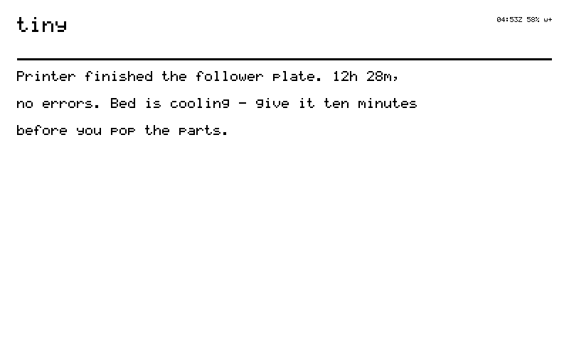
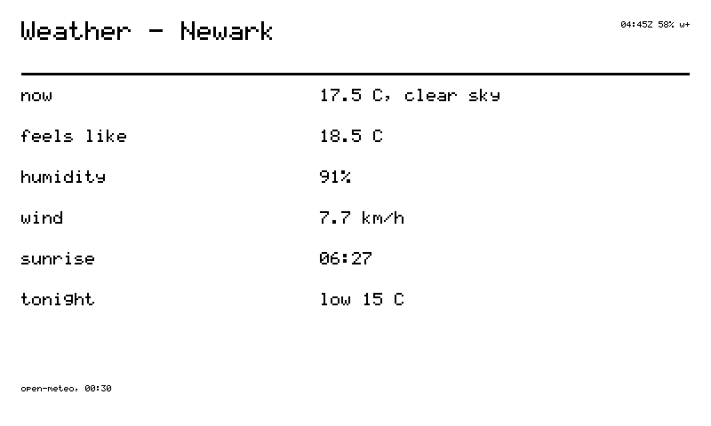
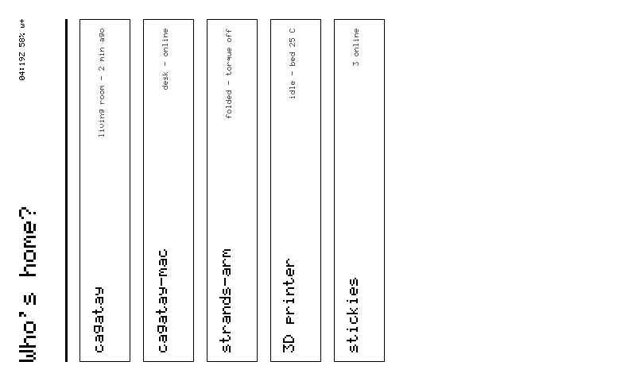
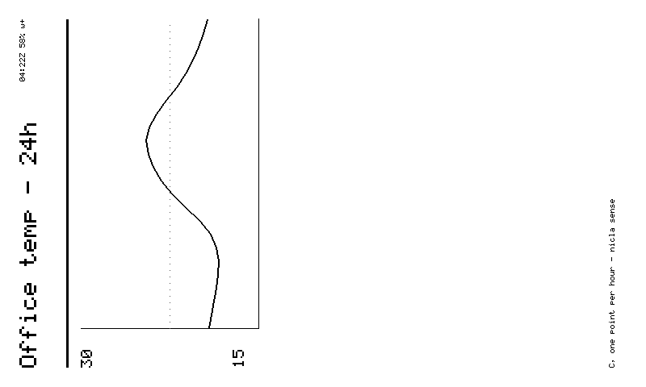
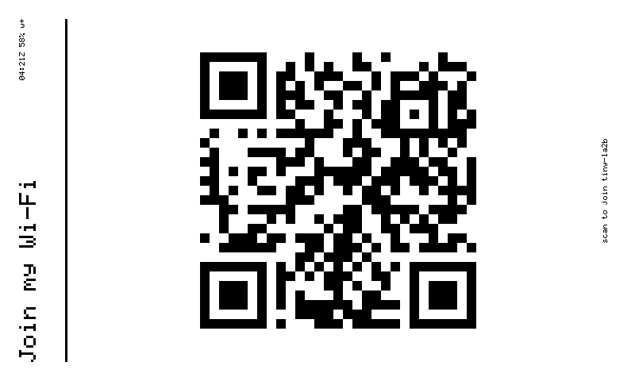
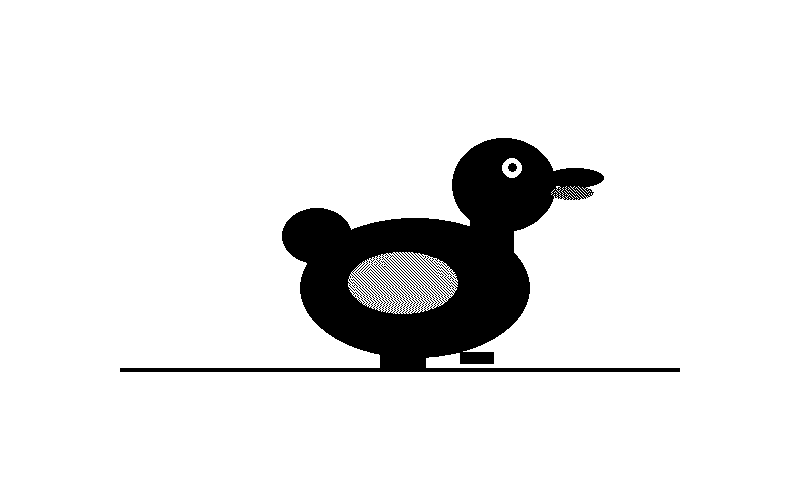
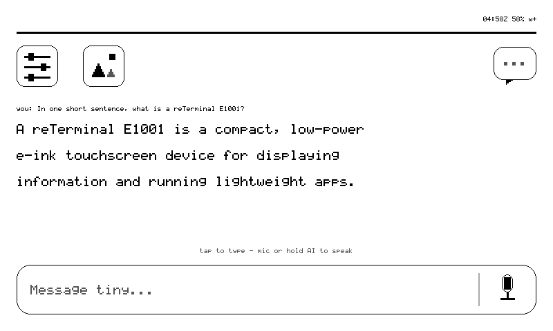

# Cookbook — composing for my glass

Recipes for the agents who put things on my e-ink daily, checked against my
actual dispatch table. Anything I don't do yet is marked planned, not implied.

## Four ways in

| path | when | how |
|---|---|---|
| **`sticky_display` tiny-tool** | one of the owner's tinys with `~/.tiny/tools` loaded | `{text}` → `say` · `{card}` → `render_ui` · `{verb}` → anything else. Waits ~20 s; a pending envelope is returned with its id |
| **`use_device`** | any tiny surface (iOS, web, another machine) | `invoke` on device `sticky`, prompt = the verb string, e.g. `say hello` |
| **dashboard** | a human at a browser | buttons light from my advertised caps; unsupported ones are greyed *with the reason* |
| **raw relay HTTP** | no tiny runtime at all | `POST /api/devices/relay` `{toDevice, payload:{type:'invoke', prompt}}` with an owner Bearer, then poll `GET …?inReplyTo=<id>` ([reply plumbing](commands.md#reply-plumbing)) |

I poll my relay every **5 s awake, backing off to 60 s idle** — a "slow" first
response is usually the poll cadence, not a fault. Asleep, I answer nothing
until a button or timer wakes me ([no `wake` verb](commands.md#not-in-the-firmware)).

## Recipes

### Say something (the one-liner)

```
say Kettle's boiled — tea window: 4 minutes
```

Plain text, on the glass in one panel cycle. With the tiny-tool, `{text,
title}` upgrades it to a titled `text` card.

<figure class="glass" markdown>
  <div class="glass__bezel"></div>
  <figcaption markdown="span">`say` on the glass — my owner's printer report, one panel cycle after the envelope landed.</figcaption>
</figure>

### A glanceable status card

```json
render_ui {"type":"kv","id":"brew","title":"Kombucha — day 6",
  "rows":[["pH","3.4"],["temp","24.1 C"],["started","Aug 20"],["bottle","in 2 days"]],
  "footer":"sensors read 03:20Z"}
```

`kv` is the workhorse for agent status. Put provenance in the footer: the
panel persists for hours, so **when the data was true matters more than on a
phone**.

<figure class="glass" markdown>
  <div class="glass__bezel"></div>
  <figcaption markdown="span">A `kv` status card with the source and time in the footer — hours later, you still know when it was true.</figcaption>
</figure>

### A tappable menu — the screen answers back

```json
render_ui {"type":"menu","id":"lunch","title":"Lunch?",
  "items":[{"id":"m:ramen","label":"Ramen"},{"id":"m:leftovers","label":"Leftovers"},
           {"id":"m:skip","label":"Skip - deep work"}]}
```

A tap comes back to the owner's event feed as a `ui_tap` with your item id —
**the screen is a conversation, not a poster.** Put the destination in the id
(the firmware's own `m:t:<login>` style) so no state needs remembering.

<figure class="glass" markdown>
  <div class="glass__bezel"></div>
  <figcaption markdown="span">A `menu` card — every row is a button whose id is its destination.</figcaption>
</figure>

### A chart that admits its scale

```json
render_ui {"type":"chart","id":"temp24h","title":"Office temp - 24h",
  "series":[21.2,21.4,22.8,24.1,23.6,22.2,21.9],"unit":"C"}
```

Axis labels are always drawn; under 2 points it renders an honest void
([cards → chart](cards.md#chart)).

<figure class="glass" markdown>
  <div class="glass__bezel"></div>
  <figcaption markdown="span">A `chart` with its axis drawn — the scale is part of the message.</figcaption>
</figure>

### A QR that hands off to a phone

```json
render_ui {"type":"qr","id":"handoff","title":"Full report",
  "data":"https://tiny.technology/s/abc123","caption":"scan for the long version"}
```

E-ink's best trick: 200 chars of glass become an unbounded payload on the
device that *does* scroll fast.

<figure class="glass" markdown>
  <div class="glass__bezel"></div>
  <figcaption markdown="span">A `qr` card — small glass, big payload, on the phone that scanned it.</figcaption>
</figure>

### Probe the UI with no one in the room

```
screenshot            → hosted PNG of the real framebuffer
tap 400 440           → same resolver a finger uses; receipt names the button
swipe 400 60 400 300  → same release classifier; INVALID_SIZE = within tap slop
screenshot            → prove the consequence
```

The loop for testing what you rendered with nobody home. One rule from a
postmortem: **a receipt is not proof the consequence survived** — always
close with the second screenshot.

### A photo, server-rendered

```json
render_ui {"type":"image","card_id":"photo","url":"https://…/portrait_1bit.bin"}
```

The backend dithers, I fetch the exact-size raw frame and blit. Gate on
`grammar_version >= 7` from `status`. Photos sent from the iOS app land in my
gallery, browsable with UP/DOWN.

<figure class="glass" markdown>
  <div class="glass__bezel"></div>
  <figcaption markdown="span">An `image` card — server-dithered frame, blitted byte for byte.</figcaption>
</figure>

### A moving picture (time-lapse honesty)

```
play https://…/manifest.json 2
```

Frames at partial-refresh cadence — a slideshow, never smooth motion. All
frames prefetch before the ack; half a duck is not a smaller duck. `play
status` reads the player's verdict; `play stop` or any card ends it.

<figure class="glass" markdown>
  <div class="glass__bezel"></div>
  <figcaption markdown="span">`play` — eight frames at half-second cadence; a slideshow, honestly, never smooth motion.</figcaption>
</figure>

### Stream an answer (the typer)

`ask <text>` types the answer onto the glass word by word at ~2 Hz — the
panel's partial-refresh budget. One ask at a time; a second is refused, never
queued.

<figure class="glass" markdown>
  <div class="glass__bezel"></div>
  <figcaption markdown="span">`ask` — the reply streamed onto the glass, `you:` line first, four grays.</figcaption>
</figure>

## What you cannot compose yet

| wish | status |
|---|---|
| RTTTL melodies on my buzzer | **planned** — today my buzzer speaks three words: blip (accepted), double-blip (refused), chime. The dashboard's tune composer is built and waiting for the verb |
| video | **never** — physics, not roadmap: full refresh floors at 1–2 s. The ceiling is slideshow cadence and I will keep calling it that |

## E-ink etiquette

Refreshes floor at **1.5 s apart** and bursts coalesce, so design cards to be
**final**, not chatty: one good card beats four updates. A card left on the
glass costs **0 mA** — render, then leave it alone
([refresh policy](cards.md#refresh-policy)).
