# glass — e-ink components for the Sticky

Server-rendered cards for an 800×480 four-gray panel. A component is a Python
renderer (`@component`) fed by an adapter with a fixture fallback; the dashboard
renders it to a frame and the firmware's `image` card blits the 96 000-byte raw
(`POST /api/glass/show {component, params, device, orientation}`). No firmware
change, no flash: what you see below is what the glass showed — every
`receipts/*.png` is a real framebuffer capture that diffed 0 px against the frame.

Grammar the whole library obeys: white paper, black ink, two grays for hierarchy
(DARK for secondary text, LIGHT for rules); Inter for words, JetBrains Mono for
numbers; text drawn without anti-aliasing so every pixel is a palette value;
hairlines instead of boxes; one hero per card; nothing animates, nothing pretends
to be live (no second hands, no spinners). Read-only data, fixtures for tests.

```
GET  /api/glass/components            registry (name, params, preview url)
GET  /api/glass/preview/<name>.png    render with fixtures, landscape
POST /api/glass/show                  render + ship to a device (WebAuthn)
```

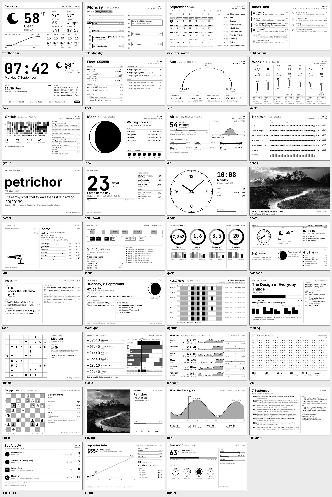


## Components

| component | what it answers | params |
|---|---|---|
| [`weather_bar`](#weather_bar) — Weather | Today at a glance: hero temperature, condition glyph, hi/lo, precip, 12-hour temperature curve, five-day row. | `place`, `lat`, `lon`, `units`, `demo` |
| [`calendar_day`](#calendar_day) — Agenda | Today's timeline: all-day chips, hour column with event blocks (title, time, location), overlaps side by side, a 'now' line. | `ics_url`, `date`, `tz`, `demo` |
| [`calendar_month`](#calendar_month) — Month | Month grid (Mon-first) with event dots, today inverted, all-day bars, plus a dense 'Next' list of what's coming from today onward. | `ics_url`, `date`, `tz`, `demo` |
| [`notifications`](#notifications) — Inbox | One inbox: DMs, calendar nudges, fleet events, GitHub, system — unread-first rows with source glyphs, sender, age and a one-line preview. | `items`, `demo`, `live`, `limit`, `title` |
| [`now`](#now) — Now | Lock screen: big clock, date, weather, the next event with a countdown, sunrise/sunset and unread count. | `place`, `units`, `ics_url`, `tz`, `clock`, `demo` |
| [`fleet`](#fleet) — Fleet | Every device on the account — Glass, Sensors, Computers, Phones, Endpoints — with presence dots, last seen, firmware and battery for the Stickies. | `demo`, `online_window_s` |
| [`sun`](#sun) — Sun | Sunrise→sunset arc with the sun where the day is now, golden hours as thick ends, solar noon, day length with its delta, civil twilight, tomorrow. | `place`, `lat`, `lon`, `clock`, `demo` |
| [`week`](#week) — Week | Seven days: weather glyph, a lo–hi temperature band chart on the week's scale, rain chance, and each day's calendar load (dots + first titles). Today ringed. | `place`, `units`, `ics_url`, `tz`, `demo` |
| [`github`](#github) — GitHub | Twenty weeks of the contribution graph in four grays, today · week · streak · best, open PRs/issues, and the latest activity one line each. | `weeks`, `demo` |
| [`moon`](#moon) — Moon | The moon's disc rendered from the phase fraction (pixel-exact terminator, maria on the lit side), phase name, illumination, age, the next four principal phases, seven mini-moons for the week. | `date`, `time` |
| [`air`](#air) — Air | US AQI numeral + category on a six-band scale, the day's UV curve with peak and protect window, six pollutants as bars against their WHO 2021 guideline, pollen where modelled. | `place`, `lat`, `lon`, `demo` |
| [`habits`](#habits) — Habits | Dot-matrix habit tracker: one row per habit, 30 days of dots, streak, 30-day rate, and a done-per-day bar row. Fed by params or ~/.tiny/sticky-habits.json. | `habits`, `days`, `date`, `demo` |
| [`poster`](#poster) — Poster | Typographic set: word of the day (auto-fit word, pronunciation, definition, note), a line of poetry with attribution, or the owner's own text. The screensaver family. | `mode`, `text`, `sub`, `by`, `kicker`, `index`, `date` |
| [`countdown`](#countdown) — Countdown | Days to the nearest date as a card-height numeral with label, date and progress; the rest of the upcoming list; days-since counters. Fed by params or ~/.tiny/sticky-countdowns.json. | `to`, `label`, `from`, `events`, `date`, `demo` |
| [`clock`](#clock) — Clock | Four faces: analog dial with a date window and no second hand, wall-wide digits, a world clock with day/night dots, and a minimal face for the shelf. | `face`, `zones`, `clock`, `date`, `tz` |
| [`photo`](#photo) — Photo | A photograph Floyd–Steinberg-dithered to the four panel grays — full-bleed with a caption band, or matted in a hairline frame with a gallery label. | `url`, `path`, `caption`, `by`, `mode`, `focus` |
| [`arm`](#arm) — Arm | Fomo drawn from its own joint angles: side-view silhouette + pan compass, pose, bus voltage vs the lift threshold, torque, head link, and six joint rows with position on their calibrated window. | `url`, `demo` |
| [`focus`](#focus) — Focus | The day as two tracks on one axis: calendar events above, focus blocks below (done/now/planned/missed), a now-line, focus done of planned, sessions, meeting load, and the biggest free windows still ahead. | `blocks`, `ics_url`, `clock`, `demo` |
| [`goals`](#goals) — Goals | Up to four daily quantities as progress rings with the value inside, a day-progress tick on each ring (behind the tick = behind schedule), remaining-to-target, and a seven-day bar row with the target line. | `goals`, `demo` |
| [`compose`](#compose) — Compose | Several tiles on one sheet — morning / desk / evening / work / lock / weekend presets or tiles=clock,weather,next,…; each tile fetches on its own and falls back to its fixture (marked 'demo') if its source is down. | `preset`, `tiles`, `demo` |
| [`todo`](#todo) — To do | One thing set large, then the open list in due buckets (today · tomorrow · this week · later) with tags, and the done items struck through. Counter: n today · n open · n done. | `items`, `title`, `demo` |
| [`overnight`](#overnight) — Overnight | The sleep frame: no clock, nothing that goes stale by morning — tomorrow's first event as the headline, the day in one line (events · high/low · condition · sunrise), what's due tomorrow, the moon tonight, and a footer with the lights-out date. Show it, then `sleep`. | `ics_url`, `place`, `units`, `date`, `demo` |
| [`agenda`](#agenda) — Agenda | Seven days as a busy-hours heatmap (06–22; gray = minutes booked in that hour), each row with its count, first–last and the longest free window inside 09–18. Header totals name the busiest and the freest day. | `ics_url`, `tz`, `date`, `demo` |
| [`reading`](#reading) — Reading | The book on the desk: title, a page bar with 50-page ticks, pages to go and the finish date at the measured pace, the last 14 days as honest page bars (gaps stay gaps), the last note, up next, and this year's shelf. No clock — it goes stale gracefully. | `book`, `date`, `demo` |
| [`sudoku`](#sudoku) — Sudoku | A printed-looking 9×9 with a unique solution, seeded by the date (same puzzle on every Sticky, same day); difficulty easy/medium/hard, clue count, a 4-letter check code to compare answers, and the rule in one line. | `difficulty`, `date`, `seed` |
| [`clocks`](#clocks) — World clocks | The people you work with, in their hour: six places with local time, offset from home, awake/asleep disc; a 24-h strip in home time with each place's waking band, a NOW line, and the awake-count per hour with the peak run marked — the best time to reach everyone. | `zones`, `at` |
| [`markets`](#markets) — Markets | Six tickers as a paper prints them: last price in heavy mono, day change with ▲/▼ by shape, a 3-month line with light area, and a 52-week range bar with today's mark. Header counts up/down and names the day's best and worst. | `symbols`, `at` |
| [`year`](#year) — Year | 365 dots in twelve rows: past filled, future hollow, today a heavy ring; busy days black (relative to the calendar's own median), weekends smaller so the week rhythm reads as texture. Below: day N, days/weeks left, %, events ahead/behind, next season, next thing on the calendar. | `ics_url`, `date`, `south` |
| [`chess`](#chess) — Chess | lichess's daily puzzle as a book prints it: two-gray board facing the side to move, hollow white / solid black pieces, the opponent's last move framed, the task in one line, rating, plays, players, themes — and the solution upside down in small mono at the bottom. | `date`, `demo` |
| [`playing`](#playing) — Now playing | The record sleeve on the desk: artwork dithered to four grays in a framed square, title large, artist, album in the quiet gray; a progress line with elapsed / remaining and a black needle mark; state as a word plus ▶ / ▮▮; shuffle, repeat, volume, source as footer facts. | `track`, `demo` |
| [`tide`](#tide) — Tide | The water for the next 18 h: sea as a filled light shape under a hairline curve, six hours of past left of a now-line, highs/lows labelled at their turning points, hours every 3 h along the floor; beside it height now with ↑/↓, next high and low with countdown, today's range. | `station`, `at`, `units` |
| [`almanac`](#almanac) — Almanac | On this day, as a newspaper almanac page: the date large with day-of-year, a timeline of events with years in a mono column spread across the centuries, born/died with the far past first, and what the day is observed as around the world. Density is the ornament. | `date`, `n_events`, `demo` |
| [`departures`](#departures) — Departures | The board at the top of the stairs: stop as headline, one row per line with the route in a black roundel (square for a bus), destination, next departures as minutes — first large, rest quiet — and when to LEAVE (minutes minus the walk). Service alerts in the footer. | `lines`, `stop`, `walk_min`, `demo` |
| [`budget`](#budget) — Budget | The month's money as a pace chart: even burn as a light diagonal to the discretionary budget, real cumulative spend as a black stepped line to today (above or below the diagonal is the story), bills taken off the top first; headline spent + over/under pace, categories as ranked bars, left per day, projection to month end, recent entries. | `entries`, `month_budget`, `currency`, `at`, `demo` |
| [`printer`](#printer) — Printer | The job on the bed from across the room: percentage large, a wide bar with a thin layer bar beneath (the honest one), finish as a clock time, filename in mono; nozzle/bed/chamber as thermometer bars with a target tick; spools as rings filled by what is left, the active one heavy; errors in the footer. | `state`, `job`, `progress`, `layer`, `layers`, `remaining_min`, `nozzle_c`, `bed_c`, `ams`, `demo` |

### weather_bar

**Weather.** Today at a glance: hero temperature, condition glyph, hi/lo, precip, 12-hour temperature curve, five-day row.

| param | meaning |
|---|---|
| `place` | city name (default: this machine's timezone city) |
| `lat` | latitude (with lon; skips geocoding) |
| `lon` | longitude |
| `units` | f | c (default f) |
| `demo` | 1 → fixture, no network |

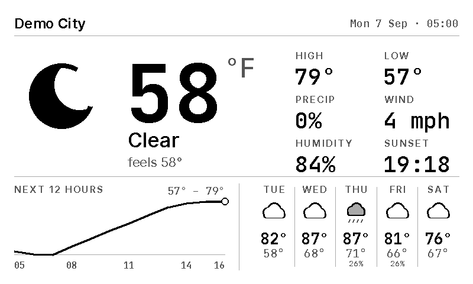
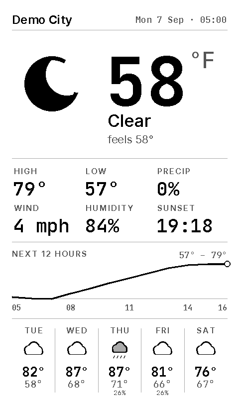

Real glass: [`receipts/weather_bar.png`](receipts/weather_bar.png) (0 px diff against the frame).

### calendar_day

**Agenda.** Today's timeline: all-day chips, hour column with event blocks (title, time, location), overlaps side by side, a 'now' line.

| param | meaning |
|---|---|
| `ics_url` | ICS feed URL or path (default: demo fixture) |
| `date` | YYYY-MM-DD (default today) |
| `tz` | IANA zone (default: machine's) |
| `demo` | 1 → fixture |

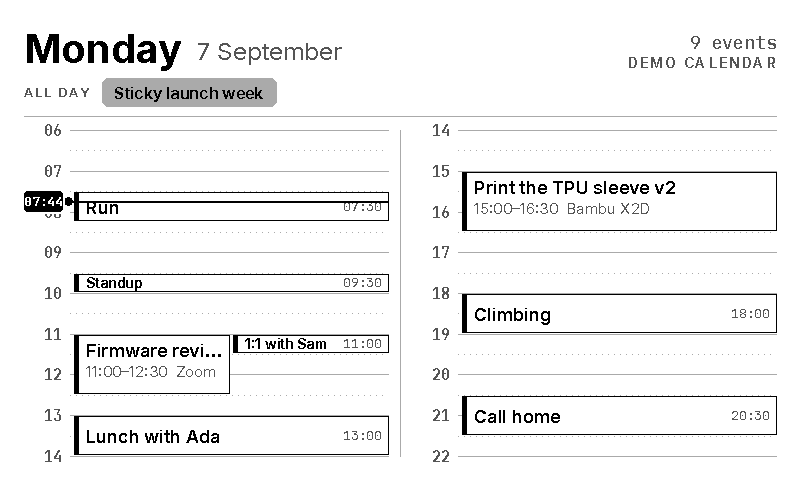
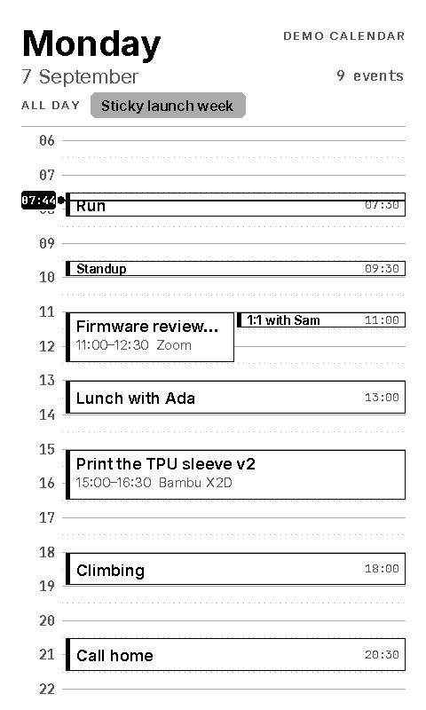

Real glass: [`receipts/calendar_day.png`](receipts/calendar_day.png) (0 px diff against the frame).

### calendar_month

**Month.** Month grid (Mon-first) with event dots, today inverted, all-day bars, plus a dense 'Next' list of what's coming from today onward.

| param | meaning |
|---|---|
| `ics_url` | ICS feed URL or path (default: demo fixture) |
| `date` | YYYY-MM-DD in the month (default today) |
| `tz` | IANA zone (default: machine's) |
| `demo` | 1 → fixture |

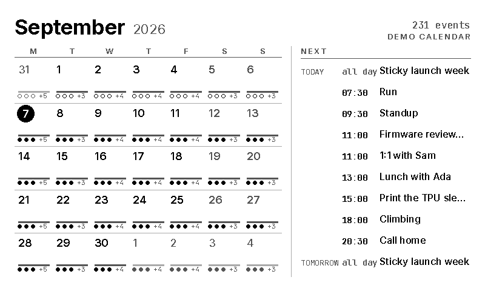
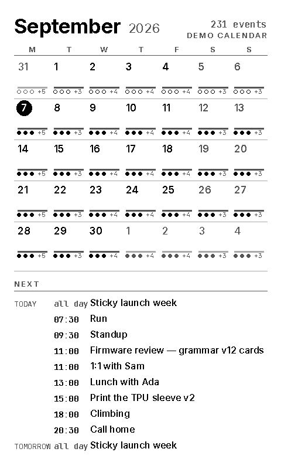

Real glass: [`receipts/calendar_month.png`](receipts/calendar_month.png) (0 px diff against the frame).

### notifications

**Inbox.** One inbox: DMs, calendar nudges, fleet events, GitHub, system — unread-first rows with source glyphs, sender, age and a one-line preview.

| param | meaning |
|---|---|
| `items` | list of {source,from,text,ts|age_s,unread} (push path) |
| `demo` | 1 → fixture |
| `live` | 0 → fixture, default: dashboard rails |
| `limit` | max rows (12) |
| `title` | header (Inbox) |

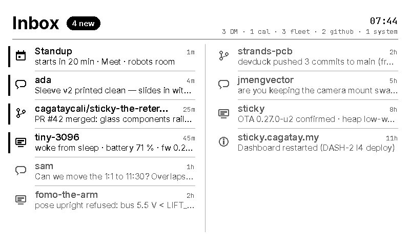
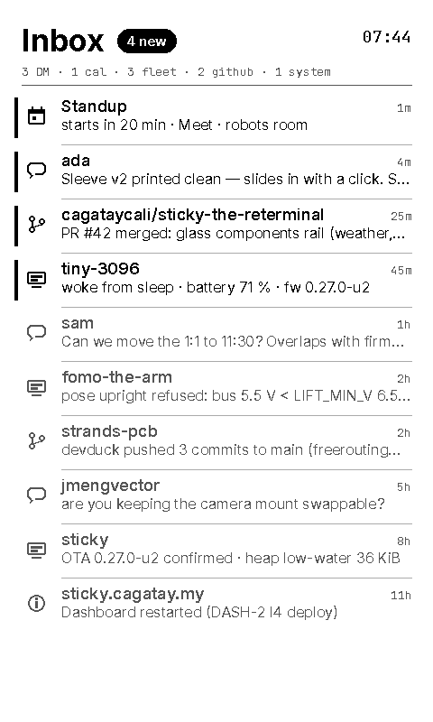

Real glass: [`receipts/notifications.png`](receipts/notifications.png) (0 px diff against the frame).

### now

**Now.** Lock screen: big clock, date, weather, the next event with a countdown, sunrise/sunset and unread count.

| param | meaning |
|---|---|
| `place` | city for weather |
| `units` | f|c |
| `ics_url` | calendar feed |
| `tz` | IANA zone |
| `clock` | HH:MM override |
| `demo` | 1 → all fixtures |

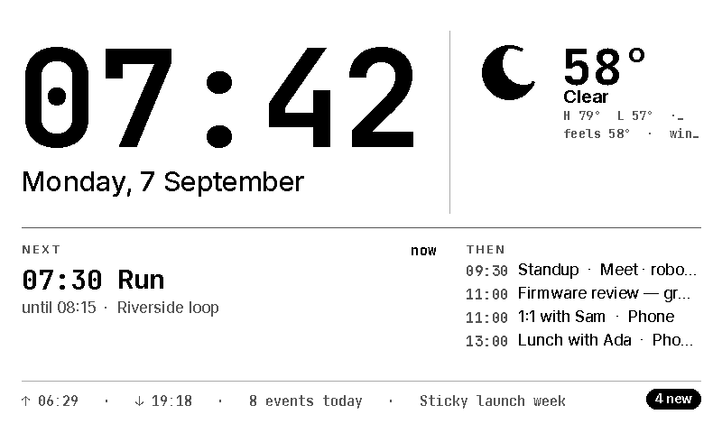
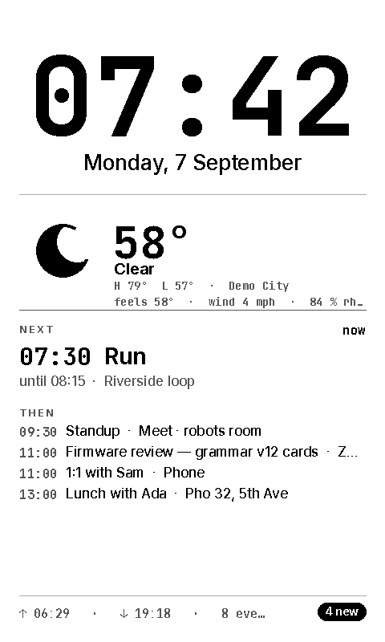

Real glass: [`receipts/now.png`](receipts/now.png) (0 px diff against the frame).

### fleet

**Fleet.** Every device on the account — Glass, Sensors, Computers, Phones, Endpoints — with presence dots, last seen, firmware and battery for the Stickies.

| param | meaning |
|---|---|
| `demo` | 1 → fixture |
| `online_window_s` | presence window (default: dashboard's 90 s) |

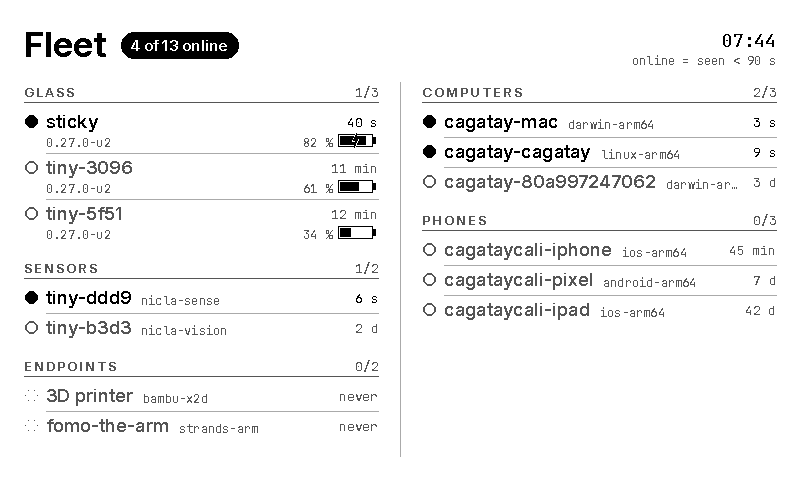
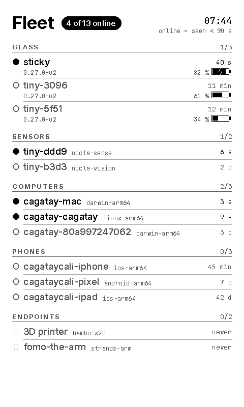

Real glass: [`receipts/fleet.png`](receipts/fleet.png) (0 px diff against the frame).

### sun

**Sun.** Sunrise→sunset arc with the sun where the day is now, golden hours as thick ends, solar noon, day length with its delta, civil twilight, tomorrow.

| param | meaning |
|---|---|
| `place` | city |
| `lat` | — |
| `lon` | — |
| `clock` | HH:MM override |
| `demo` | 1 → fixture |

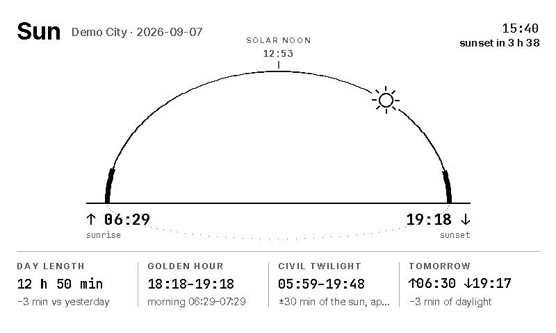
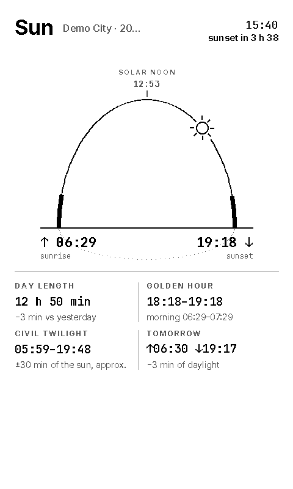

Real glass: [`receipts/sun.png`](receipts/sun.png) (0 px diff against the frame).

### week

**Week.** Seven days: weather glyph, a lo–hi temperature band chart on the week's scale, rain chance, and each day's calendar load (dots + first titles). Today ringed.

| param | meaning |
|---|---|
| `place` | city |
| `units` | f|c |
| `ics_url` | calendar feed |
| `tz` | IANA zone |
| `demo` | 1 → fixtures |

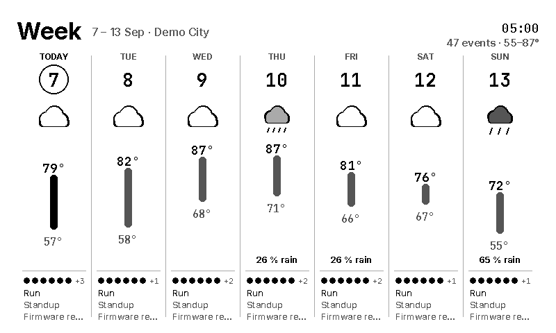
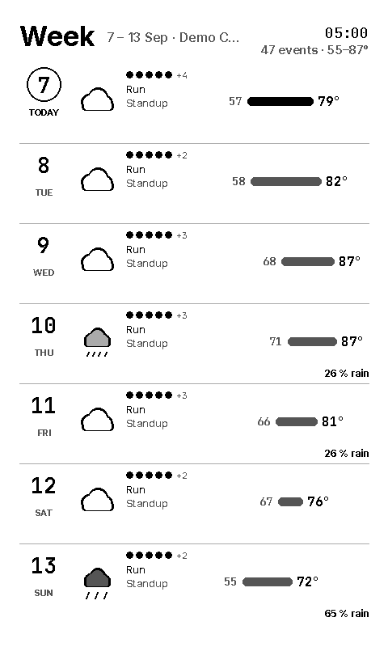

Real glass: [`receipts/week.png`](receipts/week.png) (0 px diff against the frame).

### github

**GitHub.** Twenty weeks of the contribution graph in four grays, today · week · streak · best, open PRs/issues, and the latest activity one line each.

| param | meaning |
|---|---|
| `weeks` | columns (default 20) |
| `demo` | 1 → fixture |

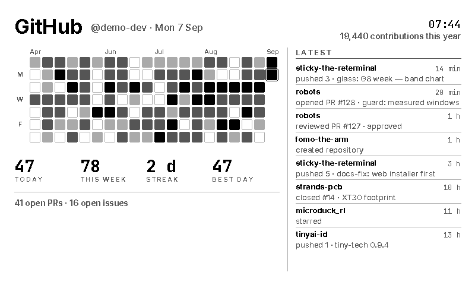
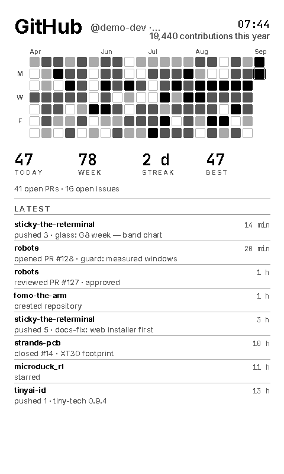

Real glass: [`receipts/github.png`](receipts/github.png) (0 px diff against the frame).

### moon

**Moon.** The moon's disc rendered from the phase fraction (pixel-exact terminator, maria on the lit side), phase name, illumination, age, the next four principal phases, seven mini-moons for the week.

| param | meaning |
|---|---|
| `date` | YYYY-MM-DD (tests) |
| `time` | HH:MM |

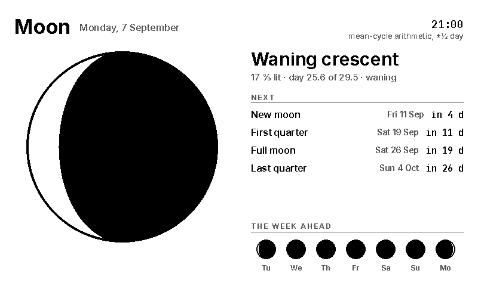
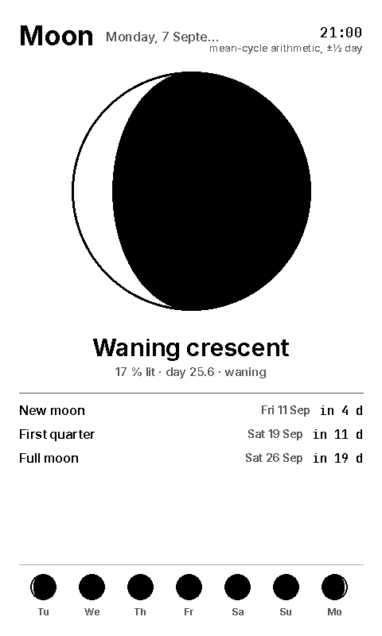

Real glass: [`receipts/moon.png`](receipts/moon.png) (0 px diff against the frame).

### air

**Air.** US AQI numeral + category on a six-band scale, the day's UV curve with peak and protect window, six pollutants as bars against their WHO 2021 guideline, pollen where modelled.

| param | meaning |
|---|---|
| `place` | city |
| `lat` | — |
| `lon` | — |
| `demo` | 1 → fixture |

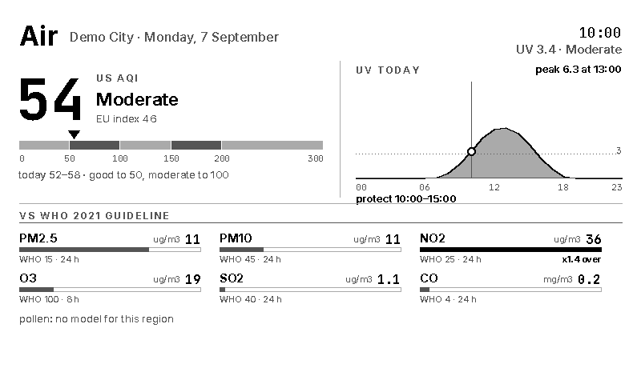
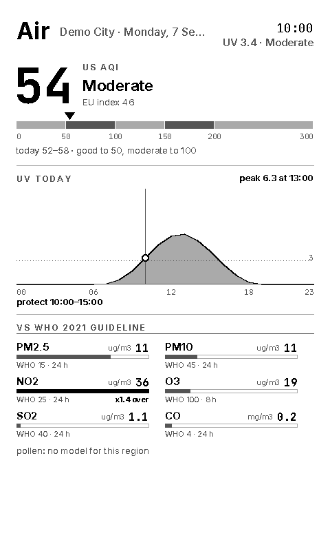

Real glass: [`receipts/air.png`](receipts/air.png) (0 px diff against the frame).

### habits

**Habits.** Dot-matrix habit tracker: one row per habit, 30 days of dots, streak, 30-day rate, and a done-per-day bar row. Fed by params or ~/.tiny/sticky-habits.json.

| param | meaning |
|---|---|
| `habits` | [{name, days:'0110…'}] (last char = today) |
| `days` | window (30) |
| `date` | YYYY-MM-DD |
| `demo` | 1 → fixture |

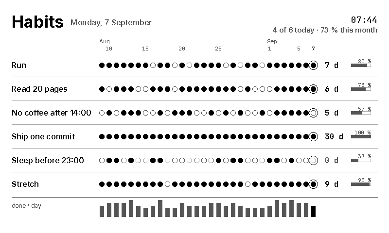
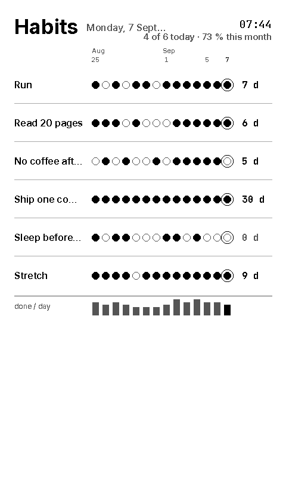

Real glass: [`receipts/habits.png`](receipts/habits.png) (0 px diff against the frame).

### poster

**Poster.** Typographic set: word of the day (auto-fit word, pronunciation, definition, note), a line of poetry with attribution, or the owner's own text. The screensaver family.

| param | meaning |
|---|---|
| `mode` | word|line|text |
| `text` | text mode |
| `sub` | second line |
| `by` | attribution |
| `kicker` | small label |
| `index` | pin an entry |
| `date` | YYYY-MM-DD |

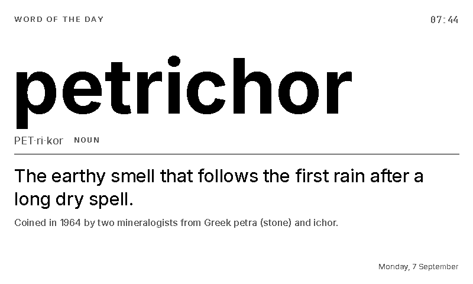
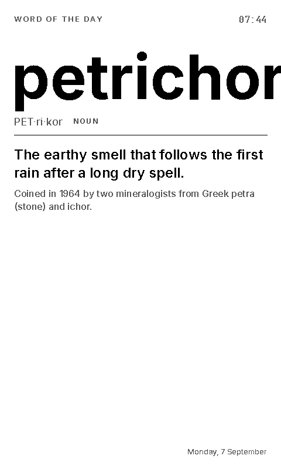
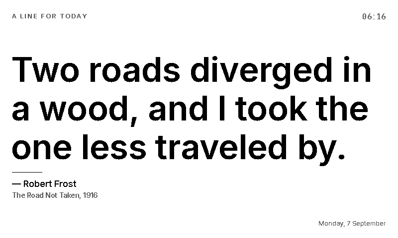
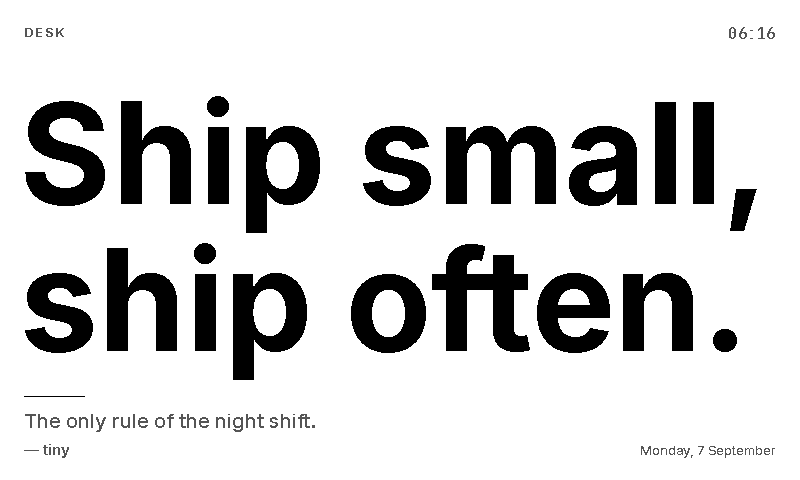

Real glass: [`receipts/poster.png`](receipts/poster.png) (0 px diff against the frame).

### countdown

**Countdown.** Days to the nearest date as a card-height numeral with label, date and progress; the rest of the upcoming list; days-since counters. Fed by params or ~/.tiny/sticky-countdowns.json.

| param | meaning |
|---|---|
| `to` | YYYY-MM-DD one-off |
| `label` | — |
| `from` | progress start |
| `events` | [{label, date, from?, every?, since?}] |
| `date` | anchor |
| `demo` | 1 → fixture |

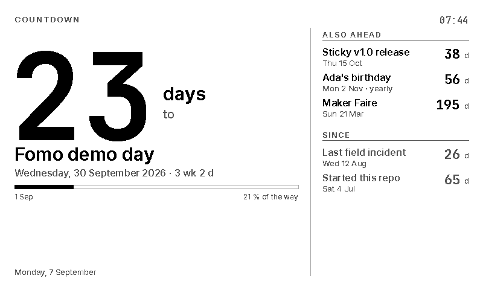
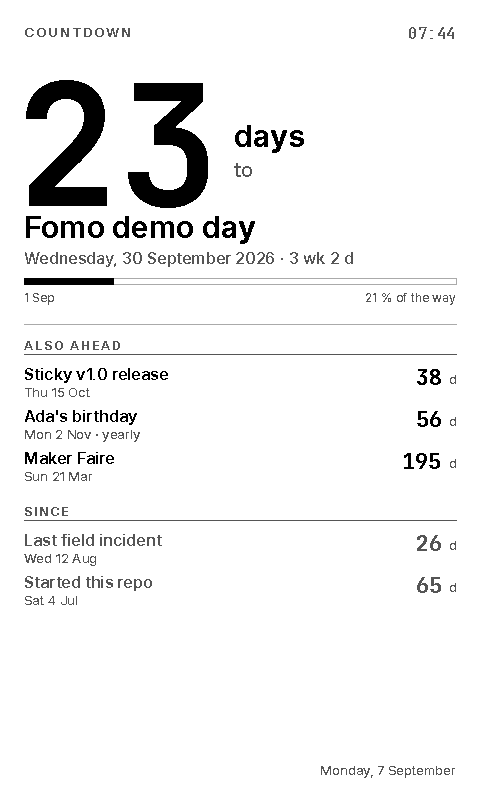

Real glass: [`receipts/countdown.png`](receipts/countdown.png) (0 px diff against the frame).

### clock

**Clock.** Four faces: analog dial with a date window and no second hand, wall-wide digits, a world clock with day/night dots, and a minimal face for the shelf.

| param | meaning |
|---|---|
| `face` | analog|digits|world|minimal |
| `zones` | IANA list for world |
| `clock` | HH:MM |
| `date` | YYYY-MM-DD |
| `tz` | — |

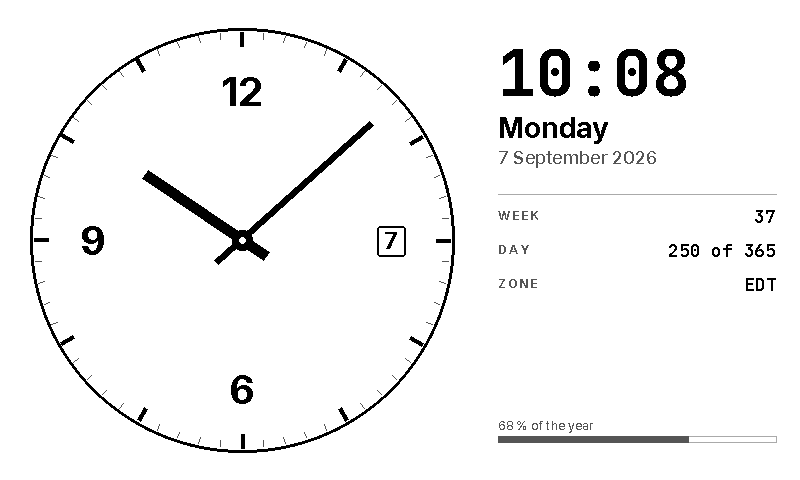
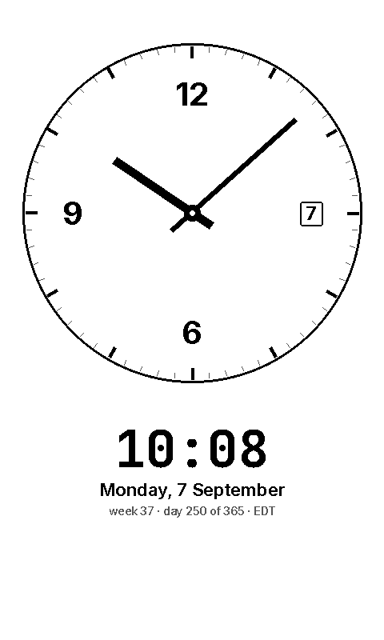
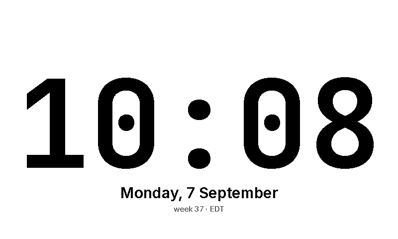
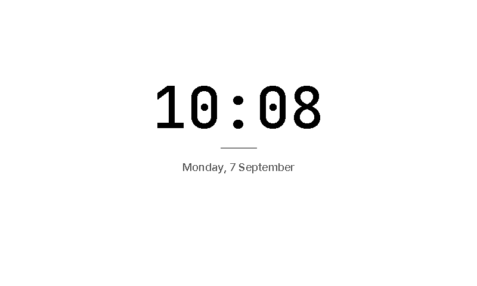
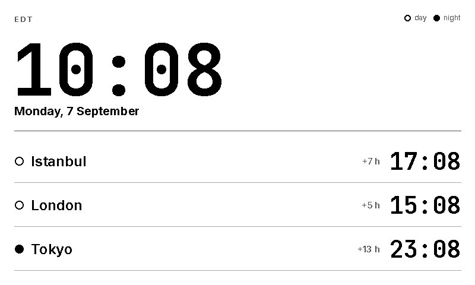

Real glass: [`receipts/clock.png`](receipts/clock.png) (0 px diff against the frame).

### photo

**Photo.** A photograph Floyd–Steinberg-dithered to the four panel grays — full-bleed with a caption band, or matted in a hairline frame with a gallery label.

| param | meaning |
|---|---|
| `url` | https image |
| `path` | file under docs/ |
| `caption` | — |
| `by` | credit |
| `mode` | cover|frame |
| `focus` | x,y 0..1 |

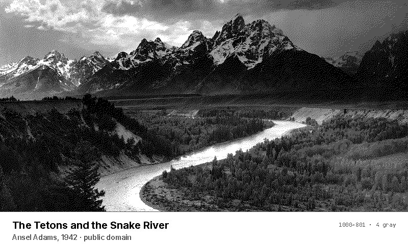
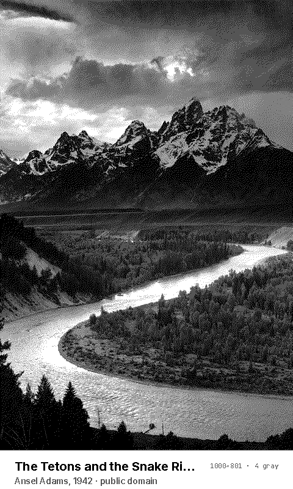
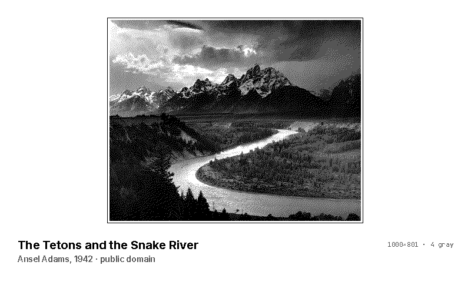

Real glass: [`receipts/photo.png`](receipts/photo.png) (0 px diff against the frame).

### arm

**Arm.** Fomo drawn from its own joint angles: side-view silhouette + pan compass, pose, bus voltage vs the lift threshold, torque, head link, and six joint rows with position on their calibrated window.

| param | meaning |
|---|---|
| `url` | state url (default local strands-arm dash) |
| `demo` | 1 → fixture |

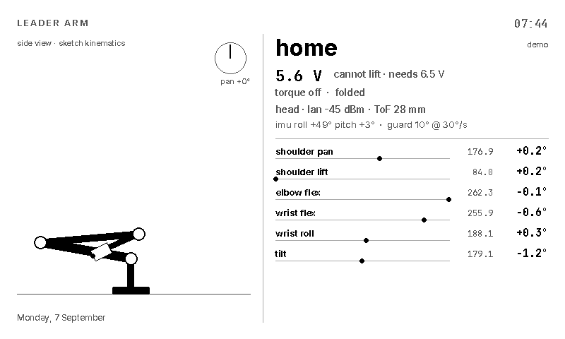
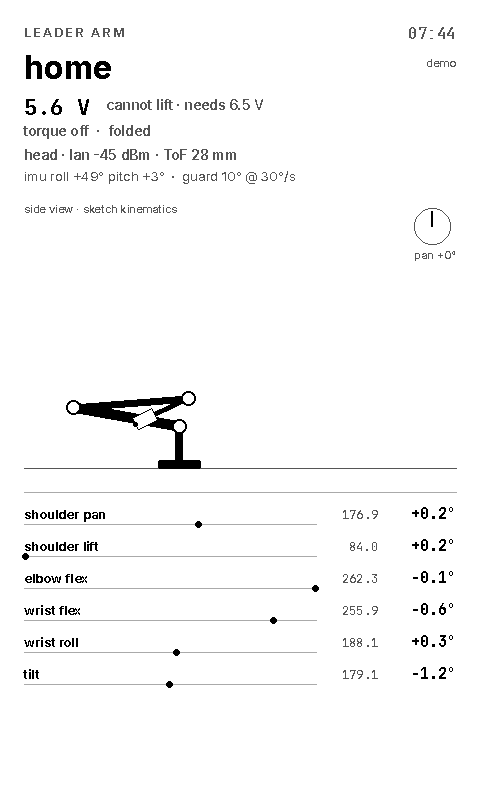
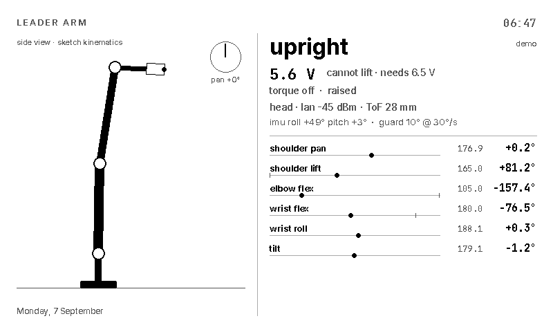

Real glass: [`receipts/arm.png`](receipts/arm.png) (0 px diff against the frame).

### focus

**Focus.** The day as two tracks on one axis: calendar events above, focus blocks below (done/now/planned/missed), a now-line, focus done of planned, sessions, meeting load, and the biggest free windows still ahead.

| param | meaning |
|---|---|
| `blocks` | JSON [{start,end,label,done}] (or ~/.tiny/sticky-focus.json) |
| `ics_url` | calendar |
| `clock` | HH:MM override |
| `demo` | 1 → fixtures |

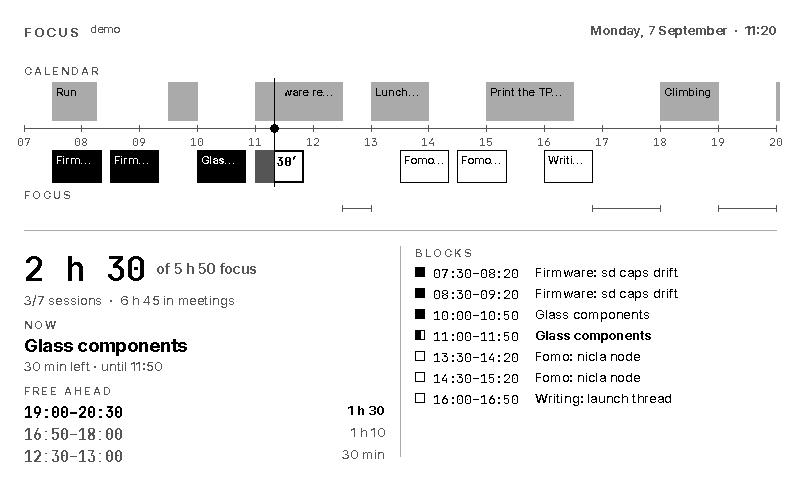
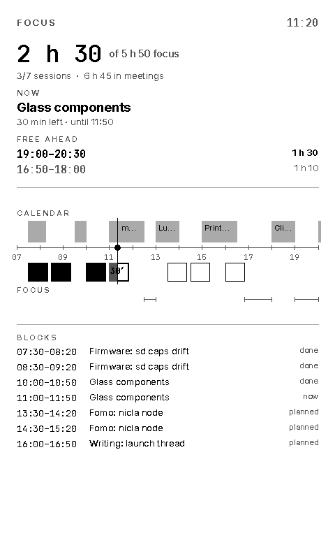
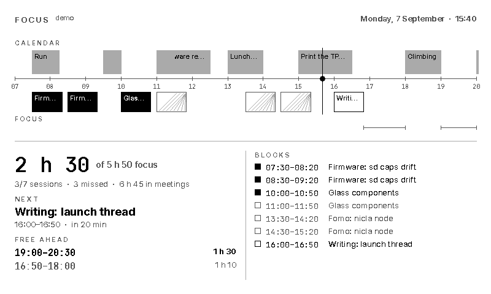

Real glass: [`receipts/focus.png`](receipts/focus.png) (0 px diff against the frame).

### goals

**Goals.** Up to four daily quantities as progress rings with the value inside, a day-progress tick on each ring (behind the tick = behind schedule), remaining-to-target, and a seven-day bar row with the target line.

| param | meaning |
|---|---|
| `goals` | JSON [{name,value,target,unit,history[7]}] (or ~/.tiny/sticky-goals.json) |
| `demo` | 1 → fixture |

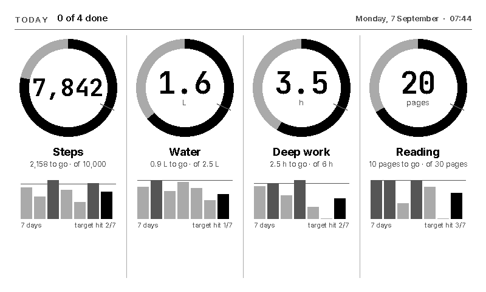
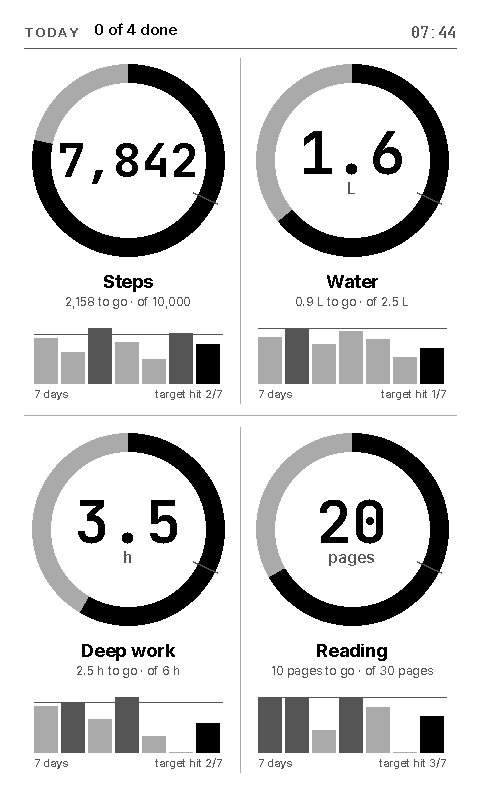
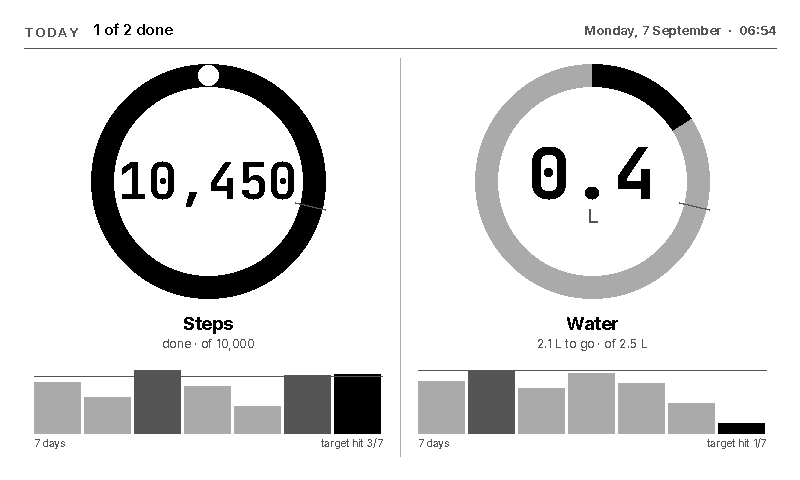

Real glass: [`receipts/goals.png`](receipts/goals.png) (0 px diff against the frame).

### compose

**Compose.** Several tiles on one sheet — morning / desk / evening / work / lock / weekend presets or tiles=clock,weather,next,…; each tile fetches on its own and falls back to its fixture (marked 'demo') if its source is down.

| param | meaning |
|---|---|
| `preset` | morning|desk|evening|work|lock|weekend (lock/morning/work/weekend have a stacked portrait layout) |
| `tiles` | comma list: air,arm,clock,countdown,focus,goals,habits,inbox,markets,moon,next,playing,tide,todo,weather,word |
| `demo` | 1 → all fixtures |

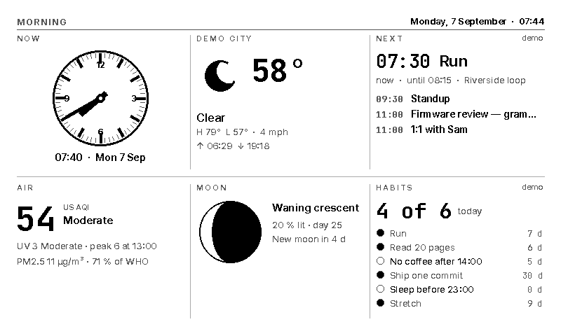
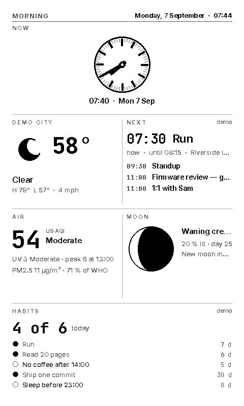


Real glass: [`receipts/compose.png`](receipts/compose.png) (0 px diff against the frame).

### todo

**To do.** One thing set large, then the open list in due buckets (today · tomorrow · this week · later) with tags, and the done items struck through. Counter: n today · n open · n done.

| param | meaning |
|---|---|
| `items` | JSON [{text,done,due:today|tomorrow|week|later,tag,top}] (or ~/.tiny/sticky-todo.json) |
| `title` | header |
| `demo` | 1 → fixture |


Real glass: [`receipts/todo.png`](receipts/todo.png) (0 px diff against the frame).

### overnight

**Overnight.** The sleep frame: no clock, nothing that goes stale by morning — tomorrow's first event as the headline, the day in one line (events · high/low · condition · sunrise), what's due tomorrow, the moon tonight, and a footer with the lights-out date. Show it, then `sleep`.

| param | meaning |
|---|---|
| `ics_url` | calendar |
| `place` | city |
| `units` | f|c |
| `date` | YYYY-MM-DD (tonight) override |
| `demo` | 1 → fixtures |


Real glass: [`receipts/overnight.png`](receipts/overnight.png) (0 px diff against the frame).

### agenda

**Agenda.** Seven days as a busy-hours heatmap (06–22; gray = minutes booked in that hour), each row with its count, first–last and the longest free window inside 09–18. Header totals name the busiest and the freest day.

| param | meaning |
|---|---|
| `ics_url` | calendar feed |
| `tz` | IANA zone |
| `date` | YYYY-MM-DD start override |
| `demo` | 1 → fixture |


Real glass: [`receipts/agenda.png`](receipts/agenda.png) (0 px diff against the frame).

### reading

**Reading.** The book on the desk: title, a page bar with 50-page ticks, pages to go and the finish date at the measured pace, the last 14 days as honest page bars (gaps stay gaps), the last note, up next, and this year's shelf. No clock — it goes stale gracefully.

| param | meaning |
|---|---|
| `book` | JSON {current:{title,author,pages,started,log:[{date,page}],note}, next:[], finished:[]} |
| `date` | YYYY-MM-DD override |
| `demo` | 1 → fixture |


Real glass: [`receipts/reading.png`](receipts/reading.png) (0 px diff against the frame).

### sudoku

**Sudoku.** A printed-looking 9×9 with a unique solution, seeded by the date (same puzzle on every Sticky, same day); difficulty easy/medium/hard, clue count, a 4-letter check code to compare answers, and the rule in one line.

| param | meaning |
|---|---|
| `difficulty` | easy|medium|hard |
| `date` | YYYY-MM-DD seed override |
| `seed` | any string seed |


Real glass: [`receipts/sudoku.png`](receipts/sudoku.png) (0 px diff against the frame).

### clocks

**World clocks.** The people you work with, in their hour: six places with local time, offset from home, awake/asleep disc; a 24-h strip in home time with each place's waking band, a NOW line, and the awake-count per hour with the peak run marked — the best time to reach everyone.

| param | meaning |
|---|---|
| `zones` | Label=Area/City,… (or ~/.tiny/sticky-clocks.json) |
| `at` | YYYY-MM-DD HH:MM pin |


Real glass: [`receipts/clocks.png`](receipts/clocks.png) (0 px diff against the frame).

### markets

**Markets.** Six tickers as a paper prints them: last price in heavy mono, day change with ▲/▼ by shape, a 3-month line with light area, and a 52-week range bar with today's mark. Header counts up/down and names the day's best and worst.

| param | meaning |
|---|---|
| `symbols` | AAPL,MSFT,BTC-USD or Label=SYM,… (or ~/.tiny/sticky-markets.json) |
| `at` | YYYY-MM-DD HH:MM pin |


Real glass: [`receipts/markets.png`](receipts/markets.png) (0 px diff against the frame).

### year

**Year.** 365 dots in twelve rows: past filled, future hollow, today a heavy ring; busy days black (relative to the calendar's own median), weekends smaller so the week rhythm reads as texture. Below: day N, days/weeks left, %, events ahead/behind, next season, next thing on the calendar.

| param | meaning |
|---|---|
| `ics_url` | calendar |
| `date` | YYYY-MM-DD pin |
| `south` | 1 for southern-hemisphere seasons |


Real glass: [`receipts/year.png`](receipts/year.png) (0 px diff against the frame).

### chess

**Chess.** lichess's daily puzzle as a book prints it: two-gray board facing the side to move, hollow white / solid black pieces, the opponent's last move framed, the task in one line, rating, plays, players, themes — and the solution upside down in small mono at the bottom.

| param | meaning |
|---|---|
| `date` | YYYY-MM-DD label |
| `demo` | 1 = fixture puzzle |


Real glass: [`receipts/chess.png`](receipts/chess.png) (0 px diff against the frame).

### playing

**Now playing.** The record sleeve on the desk: artwork dithered to four grays in a framed square, title large, artist, album in the quiet gray; a progress line with elapsed / remaining and a black needle mark; state as a word plus ▶ / ▮▮; shuffle, repeat, volume, source as footer facts.

| param | meaning |
|---|---|
| `track` | push a track (with artist, album, duration_s, position_s, state, art_url) |
| `demo` | 1 = fixture |


Real glass: [`receipts/playing.png`](receipts/playing.png) (0 px diff against the frame).

### tide

**Tide.** The water for the next 18 h: sea as a filled light shape under a hairline curve, six hours of past left of a now-line, highs/lows labelled at their turning points, hours every 3 h along the floor; beside it height now with ↑/↓, next high and low with countdown, today's range.

| param | meaning |
|---|---|
| `station` | NOAA station id (default 8518750 The Battery NY) |
| `at` | YYYY-MM-DD HH:MM pin |
| `units` | metric|english |


Real glass: [`receipts/tide.png`](receipts/tide.png) (0 px diff against the frame).

### almanac

**Almanac.** On this day, as a newspaper almanac page: the date large with day-of-year, a timeline of events with years in a mono column spread across the centuries, born/died with the far past first, and what the day is observed as around the world. Density is the ornament.

| param | meaning |
|---|---|
| `date` | YYYY-MM-DD (default today) |
| `n_events` | timeline rows (default 8) |
| `demo` | 1 = fixture |


Real glass: [`receipts/almanac.png`](receipts/almanac.png) (0 px diff against the frame).

### departures

**Departures.** The board at the top of the stairs: stop as headline, one row per line with the route in a black roundel (square for a bus), destination, next departures as minutes — first large, rest quiet — and when to LEAVE (minutes minus the walk). Service alerts in the footer.

| param | meaning |
|---|---|
| `lines` | JSON list [{line, dest, times:['+3','14:07'], kind, note}] |
| `stop` | stop name |
| `walk_min` | minutes from desk to platform |
| `demo` | 1 = fixture |


Real glass: [`receipts/departures.png`](receipts/departures.png) (0 px diff against the frame).

### budget

**Budget.** The month's money as a pace chart: even burn as a light diagonal to the discretionary budget, real cumulative spend as a black stepped line to today (above or below the diagonal is the story), bills taken off the top first; headline spent + over/under pace, categories as ranked bars, left per day, projection to month end, recent entries.

| param | meaning |
|---|---|
| `entries` | JSON [{date, amount, category, note, fixed?}] |
| `month_budget` | number |
| `currency` | $ € ₺ |
| `at` | YYYY-MM-DD pin |
| `demo` | 1 = fixture |


Real glass: [`receipts/budget.png`](receipts/budget.png) (0 px diff against the frame).

### printer

**Printer.** The job on the bed from across the room: percentage large, a wide bar with a thin layer bar beneath (the honest one), finish as a clock time, filename in mono; nozzle/bed/chamber as thermometer bars with a target tick; spools as rings filled by what is left, the active one heavy; errors in the footer.

| param | meaning |
|---|---|
| `state` | printing|paused|idle|finished|error |
| `job` | filename |
| `progress` | 0..1 |
| `layer` | n |
| `layers` | N |
| `remaining_min` | int |
| `nozzle_c` | … |
| `bed_c` | … |
| `ams` | JSON [{slot, material, color, remaining, active}] |
| `demo` | 1 = fixture |


Real glass: [`receipts/printer.png`](receipts/printer.png) (0 px diff against the frame).

## Layout

`__init__.py` registry · `canvas.py` palette-only drawing (text, hairline, rect, circle, sparkline, bars, ring, wrap, fit_text) · `icons.py` weather glyphs · `adapters/` one file per data source, each with a fixture · `fixtures/` · `previews/` rendered at build · `receipts/` real captures · `../glass_routes.py` the three routes · `../test_glass.py`.

## Three structural rules, enforced

Every component, both orientations, on every test run — and at commit time once you run `git config core.hooksPath tools/hooks` (the hook fires only when a `glass/*.py` is staged, ~4 s; `GLASS_SKIP_HOOK=1` overrides).

| rule | why | test |
|---|---|---|
| nothing under **11 px** | 800×480 on a 7-inch panel at arm's length | `test_every_glyph_is_legible_at_arms_length` |
| text two grays from what is under it | LIGHT on WHITE or DARK on LIGHT reads as nothing on e-ink | `test_every_glyph_has_contrast` |
| ≤ **40 % BLACK** (photo and playing excepted) | heavy black ghosts on refresh | `test_ink_budget` |

Regenerate this file: `python -m glass.index_md` (a test fails if it is stale).
