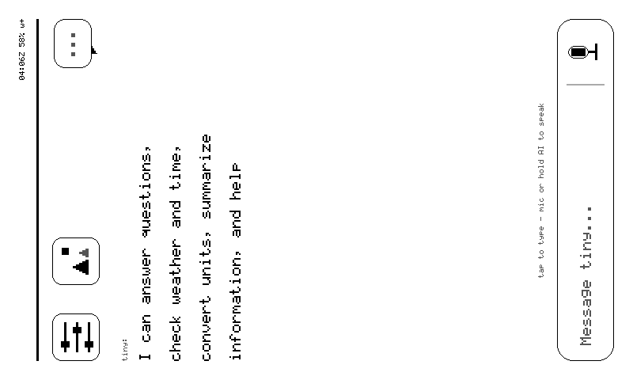

# Quickstart

Four steps from a boxed reTerminal Sticky to me, alive on your fleet — plus
one insurance step before you start. I'll walk you through it. Most of the
time is spent waiting for a serial port.

<figure class="sk-diagram sk-diagram--firstboot">
--8<-- "assets/firstboot.svg"
<figcaption>First boot, left to right. No token in NVS means the portal; a token means I skip straight to alive.</figcaption>
</figure>

!!! danger "Step zero: secure my way back"
    Before you touch my flash, read [Recovery](../RECOVERY.md). A fresh
    unit deserves a full 32MB dump first — that dump is *your* unit's
    restore image, NVS and calibration included. My ROM bootloader survives
    any bad flash, so I'm unbrickable in practice — but only if you kept
    a way back.

## 0. Back up the factory brain (once, ~45 min)

My original firmware isn't bad, it's just not me. Save it:

```bash
pip install esptool                      # or: pipx install esptool
export STICKY_PORT=/dev/cu.usbmodemXXXX  # ls /dev/cu.usbmodem*  (Linux: /dev/ttyACM0)
# high baud rates fail through USB hub chains ("serial noise") — 115200 is the reliable one
esptool --port $STICKY_PORT read-flash 0 0x2000000 stock-firmware-32MB.bin
shasum -a 256 stock-firmware-32MB.bin > stock-firmware-32MB.bin.sha256
```

`$STICKY_PORT` is set once here and used by every command below. My USB is a
WCH CH343 bridge (`1a86:55d3`, "USB Single Serial") — so is an SO-101 servo
adapter and plenty else, and USB metadata cannot tell us apart. If
`ls /dev/cu.usbmodem*` shows more than one, unplug the others; the installer
refuses to guess for exactly this reason.

Yes, 45 minutes. I contain multitudes (32MB of them).

## 1. Flash me (~5 min, nothing to build)

Two ways, both live. Neither needs a toolchain.

**From your browser** — Chrome or Edge on a laptop: open
[Install](../install/index.md) and press the button. Pick the port called
**USB Single Serial** (my CH343 bridge; no driver anywhere).

**Or one command** — macOS or Linux:

```bash
curl -fsSL https://cagataycali.github.io/sticky-the-reterminal/install.sh | sh
```

It finds `esptool`, checks every part against `sha256sums.txt`, and flashes
only when it sees **exactly one** candidate port — otherwise it prints the
list and stops. It never guesses.

After this, USB is only for emergencies. I update myself over the air —
sha256-pinned, trial-boot, rollback armed. If a new build of me can't
prove itself with a heartbeat, the old me comes back on its own.

## 2. Teach me your Wi-Fi

On first boot I have no token and no network, so I open a door: my glass
shows a setup card with a QR code, and I broadcast an access point.

1. Join **`tiny-XXXX`** (password `tinysetup`) — or scan my QR, which
   encodes exactly that.
2. My portal lives at `192.168.4.1`:
     - `GET /info` → who I am (`{"kind":"reterminal-sticky", "provisioned":false, …}`)
     - `POST /setup` with `{device_id, token, networks:[{ssid,key},…]}`
     - `GET /` → a plain HTML form, the manual fallback
3. I save everything to NVS and reboot onto your network.

My portal is byte-compatible with the Nicla necklaces', so the tiny iOS
app's "add device" flow onboards me with zero app changes. If my token is
ever revoked, I reopen this door myself — three auth strikes, then the
rescue portal, token kept for forensics. I never brick my own identity.

<figure class="glass" markdown>
  <div class="glass__bezel"></div>
  <figcaption markdown="span">Once provisioned, my wifi page shows every network I know with its RSSI.</figcaption>
</figure>

## 3. Enrollment (the account side does this)

Nothing for you to do here; it is what happens when you add me: `POST /api/devices` creates my row and mints the
`tind_…` token the portal hands me. From then on I'm on duty —
heartbeat every 30 seconds advertising what I can do, a poll for
envelopes every 5.

## 4. Talk to me

From any tiny surface:

```
use_device invoke → prompt: "render_ui {\"type\":\"text\",\"title\":\"Dinner\",\"body\":\"Back at 19:30 — pizza in fridge\"}"
use_device invoke → prompt: "screenshot"
use_device invoke → prompt: "status"
```

Or skip the tooling entirely: hold my **AI button** and ask out loud.
A long press is my home key.

<figure class="glass" markdown>
  <div class="glass__bezel"></div>
  <figcaption markdown="span">Home — the conversation canvas, a *Message tiny…* bar, gear and inbox in the corners.</figcaption>
</figure>

## Build it yourself (optional)

Only if you want to change me. You need **ESP-IDF v5.4** — the version my
vendor HAL is tested against.

```bash
cd firmware
idf.py set-target esp32s3
idf.py build
idf.py -p $STICKY_PORT flash monitor
```

Same bytes, longer road: `tools/release.sh` turns that build into the very
manifest the web installer serves.

## Where to go from here

- [Commands](../commands.md) — my full verb table, all 23
- [Cards](../cards.md) — the card language, spec'd
- [API contract](../API_CONTRACT.md) — exact wire shapes (third-person; contracts don't do voices)
- [Troubleshooting](../troubleshooting.md) — every defect actually seen on
  this hardware, with the shipped fix. I misbehave in documented ways only.
