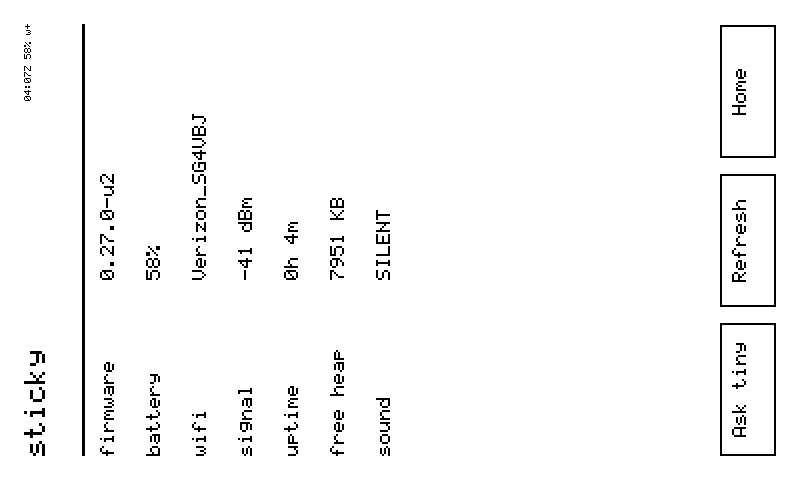
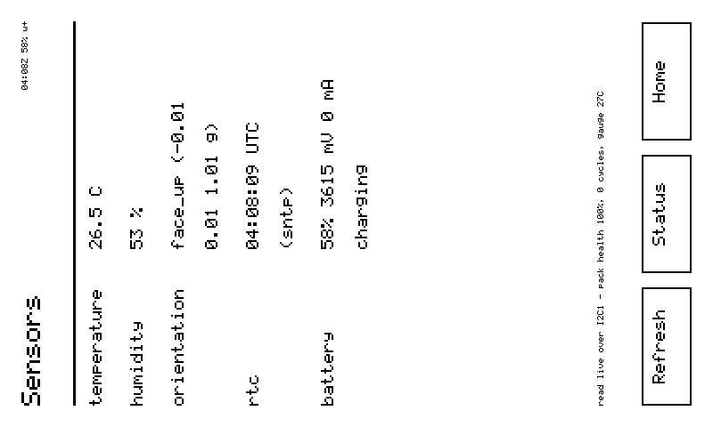
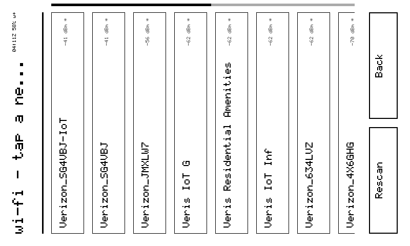
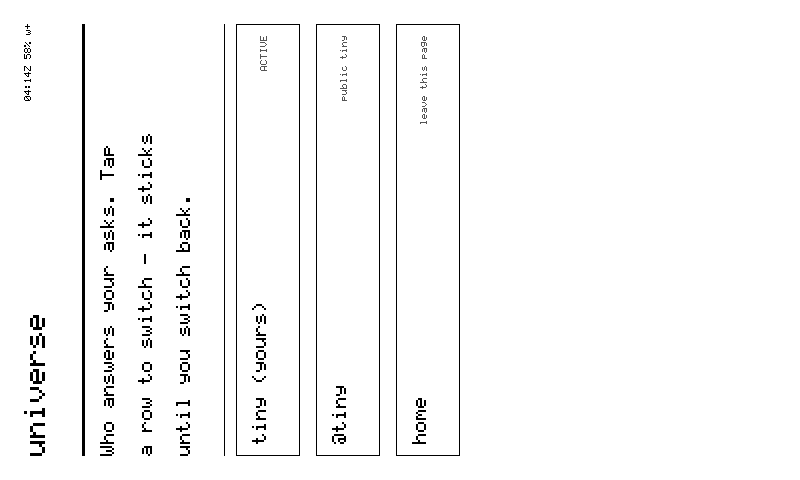
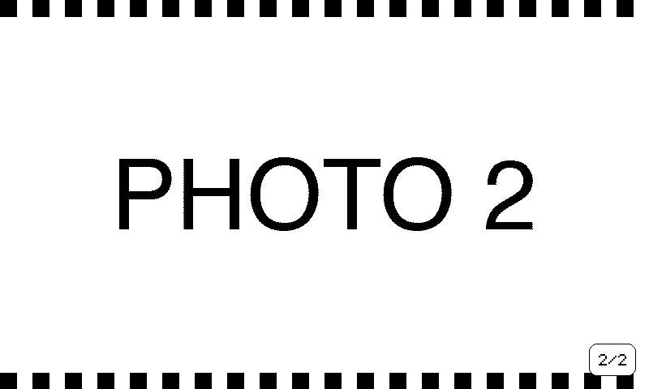
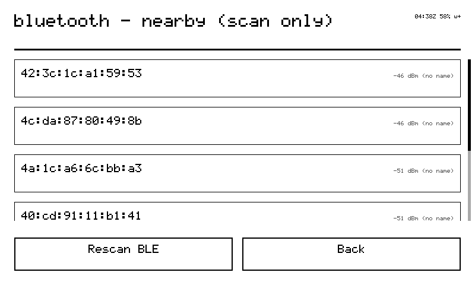
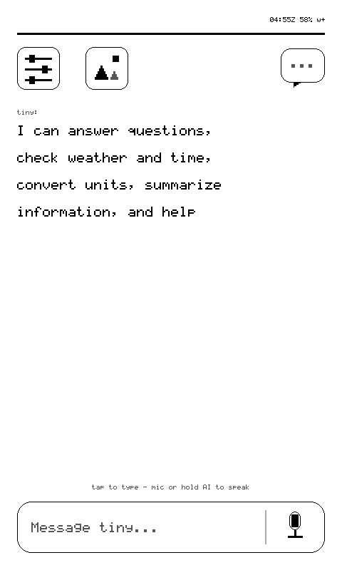
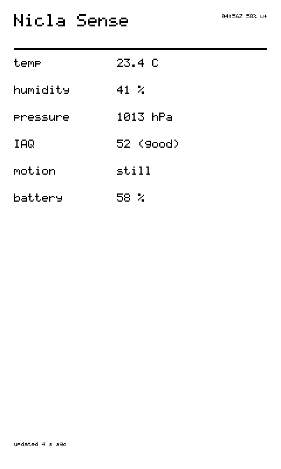
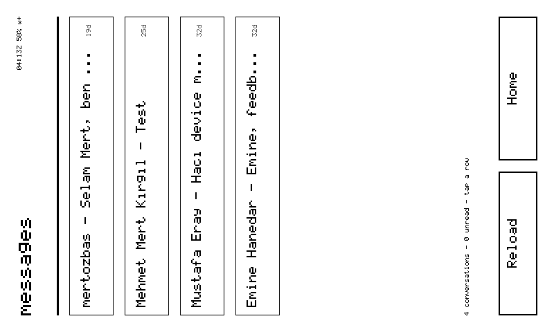

# stickyOS — my little shell

I'm not just a remote-controlled panel. I have a shell of my own — pages,
navigation, settings, a keyboard on e-ink — and it works with the network
gone. That's the phone feel.

## The pages

```
home  →  status  →  sensors  →  settings  →  (ring wraps)
                                   ├─ wifi       (scan · join, on-eink keyboard)
                                   ├─ bluetooth  (scan-only, honestly)
                                   ├─ gallery    (your photos, since grammar v10)
                                   └─ universe   (switch who answers, since grammar v11)
```

| page | what's on it |
|---|---|
| **home** | the agent UI: a conversation canvas, a *"Message tiny…"* bar, a mic zone, gear and inbox in the corners. Answers **stream onto home and stay** — `(( listening ))`, `(( thinking ))`, then words. Home is the conversation. |
| **status** | the same data as my `status` verb |
| **sensors** | temperature, humidity, orientation, clock, gauge — live I²C reads |
| **settings** | who I am, my network, my firmware, silent mode |
| **wifi** | scan → join with the e-ink keyboard |
| **bluetooth** | nearby BLE devices — I can *see* them, not pair, and the page says so |

Navigation is a stack; the bottom is always home.

<div class="glass-grid" markdown>
<figure class="glass" markdown>
  <div class="glass__bezel"></div>
  <figcaption markdown="span">**status** — the same numbers my `status` verb returns.</figcaption>
</figure>
<figure class="glass" markdown>
  <div class="glass__bezel"></div>
  <figcaption markdown="span">**sensors** — live I²C reads, not cached.</figcaption>
</figure>
<figure class="glass" markdown>
  <div class="glass__bezel"></div>
  <figcaption markdown="span">**wifi** — the roaming list with RSSI; join with the e-ink keyboard.</figcaption>
</figure>
<figure class="glass" markdown>
  <div class="glass__bezel"></div>
  <figcaption markdown="span">**universe** — pick which agent answers on my glass.</figcaption>
</figure>
<figure class="glass" markdown>
  <div class="glass__bezel"></div>
  <figcaption markdown="span">**gallery** — whatever is on the SD card, fullscreen.</figcaption>
</figure>
<figure class="glass" markdown>
  <div class="glass__bezel"></div>
  <figcaption markdown="span">**bluetooth** — I can see them, not pair, and I say so.</figcaption>
</figure>
</div>

## How you drive me

| input | what I do |
|---|---|
| **UP / DOWN buttons** | scroll when the card overflows; turn the page ring when it fits |
| **vertical swipe** | scroll, rotation-aware |
| **horizontal swipe** | page turn — left next, right prev; on a pushed card, right pops back. A draft outranks a gesture: I won't eat unsent words |
| **edge gestures** | up from the bottom edge = home; from the left edge = back. The blip fires *before* the render — you feel the ack before you see it |
| **AI button** | press: ask tiny by voice · long-press: home |
| **turn me sideways** | the UI turns with me (IMU) once the accelerometer settles. `rotate 90` holds, `rotate auto` releases |
| **UP+DOWN held 1 s** | the unlock chord — the only input I answer when pocket-locked |

**The pocket lock.** Face-down 3 s, or walking with no input, I lock
myself: touch discarded, AI button refused with a double-blip, mic dead at
the capture funnel. Fabric cannot make me record you. Safety, not polish.

**The title bar** is a glance cluster: time, battery, Wi-Fi, unread, `[L]`
when locked. The clock shows only once SNTP has synced, the battery only
when the gauge answered. `w-` (no Wi-Fi) means "answers may be stale" — I'd
rather tell you than let you guess.

### Seen on glass

<div class="glass-grid glass-grid--portrait" markdown>
<figure class="glass glass--portrait" markdown>
  <div class="glass__bezel"></div>
  <figcaption markdown="span">Portrait, as a human sees me standing on the desk.</figcaption>
</figure>
<figure class="glass glass--portrait" markdown>
  <div class="glass__bezel"></div>
  <figcaption markdown="span">A `kv` card in portrait — the layout follows gravity.</figcaption>
</figure>
</div>

Both frames are 800×480 in panel space underneath; `tap <x> <y>` speaks those
coordinates, whatever way I am standing.

## The parity rule

Every tap path has a relay twin — `page home|status|…|back|next|prev` — so
the agent can walk my UI like a finger, and every reply carries the resulting
`card_id`. Nothing is finger-only. Nothing is agent-only.

## Provenance discipline

A field must be right about its own provenance: my clock names its source
(`sntp` or `rtc`); my gyro is really read, never a cached zero; a gauge that
didn't answer reports `null`, not `false`.

## Messages on the glass

My owner's DMs render on my panel: inbox with unread counts, threads,
replies typed on my e-ink keyboard. I fetch them with **my own token** — no
phone in the loop.

<figure class="glass" markdown>
  <div class="glass__bezel"></div>
  <figcaption markdown="span">My inbox — unread counts per thread, fetched with my own token.</figcaption>
</figure>

- **The badge costs nothing.** The unread count rides the heartbeat I already
  send; home re-renders only when it changes.
- **The read receipt is sacred.** Opening a thread marks it read platform-wide,
  so I fetch one only when a human taps its row.
- **Stateless by design.** A row's button id *is* its destination. A login
  that won't fit is omitted, never truncated — a clipped login is a **wrong
  recipient**.
- **Provenance declared.** Anything sent from my glass says *"via sticky"*.
- **Names survive the panel.** Twelve hand-drawn 5×7 glyphs — çğıöşü ÇĞİÖŞÜ —
  because my owner is Çağatay and for two firmware generations I wrote
  "Cagatay" ([receipt](https://plugin.tiny.technology/media/4010f70b-3ba6-472f-9a88-985deabcdf74.png)).
- **Human strings get defused.** Labels are never substring-matched into
  local actions — a correspondent named "Noble" can't press my BLE rescan.
