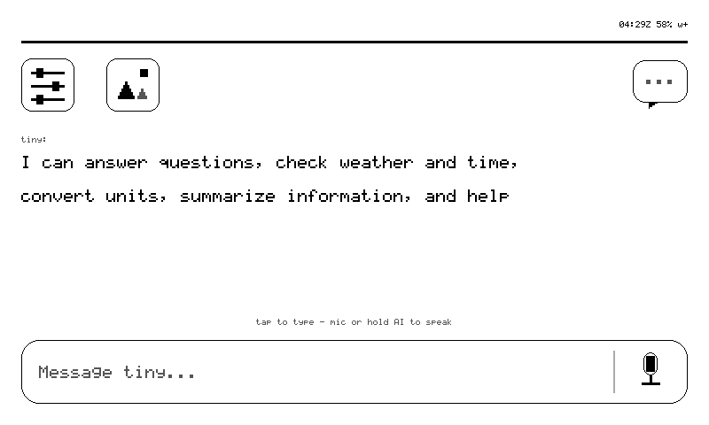

# tiny

tiny turns reTerminal Sticky into a body for your personal agent: hold the AI
button and speak, or type on the e-ink keyboard, and the answer paints itself
on the glass and stays there. The agent lives at tiny.technology; the Sticky is
a thin, honest client with a very good memory of what is on its own screen.

## Version 0.28.0

- **First-run onboarding on the glass**: welcome → Wi-Fi (QR to the setup
  portal, or scan + on-glass keyboard) → pairing → a one-screen tour. The
  setup portal runs alongside the on-device flow; either finishes the step.
- Grammar v12: `page onboard [step]` previews any first-run card; `status`
  reports `onboard`; heartbeat advertises all 23 verbs (`render_ui` `status`
  `sensors` `say` `ask` `agent` `play` `voice` `screenshot` `miccheck` `page`
  `rotate` `glance` `tap` `swipe` `scroll` `lock` `unlock` `sleep` `ota`
  `messages` `config` `sd`).
- Agent switching (the *universe* page), `@slug` badge on answers; microSD
  gallery + photo archive.

Full history: [CHANGELOG](https://github.com/cagataycali/sticky-the-reterminal/blob/main/CHANGELOG.md).

## Interface

<table>
  <tr>
    <td align="center"></td>
    <td align="center"></td>
    <td align="center"></td>
  </tr>
  <tr>
    <td align="center">kv card</td>
    <td align="center">qr card</td>
    <td align="center">portrait (auto-rotate)</td>
  </tr>
</table>

Every image above is the device's own 800×480 framebuffer, fetched over the
air with the `screenshot` verb — not a mock-up.

## What it does

- **Speaks cards.** The agent composes a card spec (`text` `list` `kv` `menu`
  `qr` `chart` `chat` `composite` `image` `gallery`); the firmware renders it
  natively in four grays and turns buttons into touch regions. Taps flow back
  as events.
- **Listens.** Hold the AI button ≥1 s, speak; a PDM mic streams a 16 kHz WAV
  through a full agent turn with tools and memory. The reply streams onto
  home at ≤2 Hz. The on-glass keyboard is the typed path.
- **Local shell (stickyOS).** home → status → sensors → settings ring on the
  UP/DOWN buttons; Wi-Fi scan + join with the keyboard; Bluetooth scan
  (scan-only, honestly); gallery; messages inbox and threads; the universe
  page to pick which agent answers.
- **Updates itself.** sha256-pinned OTA staged to the other A/B slot, boots as
  a rollback-armed trial that must heartbeat before it is committed; numeric
  version compare refuses downgrades unless the bundle says `force`.
- **Lives in a pocket.** IMU locks input when face-down or walking so fabric
  cannot hold the mic button; auto-rotate follows gravity; 30-min idle deep
  sleep at ~10–20 µA with the goodbye card left on the glass.
- **Fails honestly.** Three consecutive `401`s slow the heartbeat, keep the
  token for forensics and raise a rescue portal — identity is never wiped.

## What it cannot do

- Video: the panel needs 1–2 s for a full refresh, ~300–500 ms partial. Slideshows
  and short frame sequences, yes; 24 fps, never.
- Speak: GPIO48 drives a buzzer, not a speaker. Chimes and melodies only.
- Think offline: no Wi-Fi means no agent. Local pages and the last card stay.

## Requirements

- reTerminal Sticky (ESP32-S3R8, 32 MB flash, 8 MB PSRAM)
- USB-C data cable for browser installation
- 2.4 GHz Wi-Fi
- A **tiny.technology account** (free). The device stores only a revocable
  device token in NVS — never an account credential. NVS is not encrypted in
  this build; treat a lost board as a leaked token and revoke it.
- Optional: the tiny iOS app for one-scan onboarding; any phone browser works
  via `http://192.168.4.1`.

## Firmware package

- Latest Registry firmware version: `0.28.0` (experimental)
- Source: <https://github.com/cagataycali/sticky-the-reterminal>
- Source commit: `<filled by the release — git describe --always --abbrev=8, also reported as fw_commit in status>`
- License: Apache-2.0 (firmware); Seeed's hardware components under `vendor/`
  are redistributed as received, see the repository's `vendor/README.md`
- Build: ESP-IDF `v5.4`, target ESP32-S3, 32 MB flash, `dio` / `80m`
- Partition table: A/B OTA (`factory` + `ota_0` + `ota_1`, 4 MB each) +
  `assets` SPIFFS

The package is the four files ESP-IDF's own `flasher_args.json` flashes, at
their real offsets: `bootloader.bin` @ `0x0`, `partition-table.bin` @ `0x8000`,
`ota_data_initial.bin` @ `0xf000`, `tiny_sticky.bin` @ `0x20000`. The manifest
records byte sizes and SHA-256 values; the same bytes are published under
<https://cagataycali.github.io/sticky-the-reterminal/install/> with
`sha256sums.txt`. `tools/playground_package.sh` in the source repository
produces this directory from a clean committed build and refuses `-dirty`
artifacts.

Application SHA-256: see `firmware/0.28.0/manifest.json`.

## Installation and first boot

1. Open tiny from the reTerminal Sticky Playground in desktop Chrome or Edge.
2. Connect the device with a USB-C data cable and pick the **USB Single
   Serial** port.
3. Start the installation and accept the erase prompt.
4. The glass boots to a setup card with a QR code. Scan it with your phone to
   join the `tiny-XXXX` network (password `tinysetup`), then open the tiny
   app — or `http://192.168.4.1` in any browser — and enter your Wi-Fi.
5. The device reboots, joins your Wi-Fi, heartbeats to tiny.technology and
   paints home. Hold the AI button and ask it something.

## Daily controls

- **AI button** (top): hold ≥1 s to speak; long-press from anywhere = home.
- **UP / DOWN**: cycle home → status → sensors → settings; scroll long cards.
- **UP + DOWN held 1 s**: unlock after a pocket lock.
- **Touch**: tap buttons and menu rows; swipe left/right for pages; bottom
  edge swipe up = home; left edge swipe right = back.
- **Settings → Wi-Fi**: scan, tap a network, type the password on the glass.
- **Settings → sound**: silent mode, persists across reboot and OTA.
- Rotate the device: the page turns with it; a lock in settings pins it.
- Idle 30 min on battery → deep sleep; any button wakes it (~1.1 s to home).

## Verification

### Version 0.28.0 package

| Check | Result |
| --- | --- |
| Clean-tree build, `fw_commit` without `-dirty` | _pending_ |
| Host tests (`tests/run.sh`: askq, bootmark, sleep/wake) | Passed |
| Packaged files byte-identical to `firmware/build/` | _pending_ |
| Manifest sizes / SHA-256 regenerated from the files | _pending_ |
| Physical installation of the exact package | _pending_ |

### Physical-device record

| Item | Result |
| --- | --- |
| Hardware | reTerminal Sticky production hardware |
| Firmware version | `0.28.0` |
| Exact Registry package write (esptool, manifest offsets) | _pending_ |
| First boot → setup card with QR | _pending_ |
| Wi-Fi onboarding (portal) and heartbeat to tiny.technology | _pending_ |
| Voice ask (AI button) → answer on glass | _pending_ |
| Touch: menu rows, keyboard, home/back gestures | _pending_ |
| UP/DOWN ring + UP+DOWN unlock chord | _pending_ |
| Reboot: Wi-Fi + silent mode + rotation lock restored | _pending_ |
| Deep sleep → button wake → home | _pending_ |
| USB reconnection and repeated installation | _pending_ |

## Links

- [Project source and documentation](https://github.com/cagataycali/sticky-the-reterminal)
- [Docs site — quickstart, commands, cards, troubleshooting](https://cagataycali.github.io/sticky-the-reterminal/)
- [Browser installer with sha256 pins](https://cagataycali.github.io/sticky-the-reterminal/install/)
- [Sticky official website](https://www.seeedstudio.com/sticky/)
- [Project support](https://github.com/cagataycali/sticky-the-reterminal/issues)
